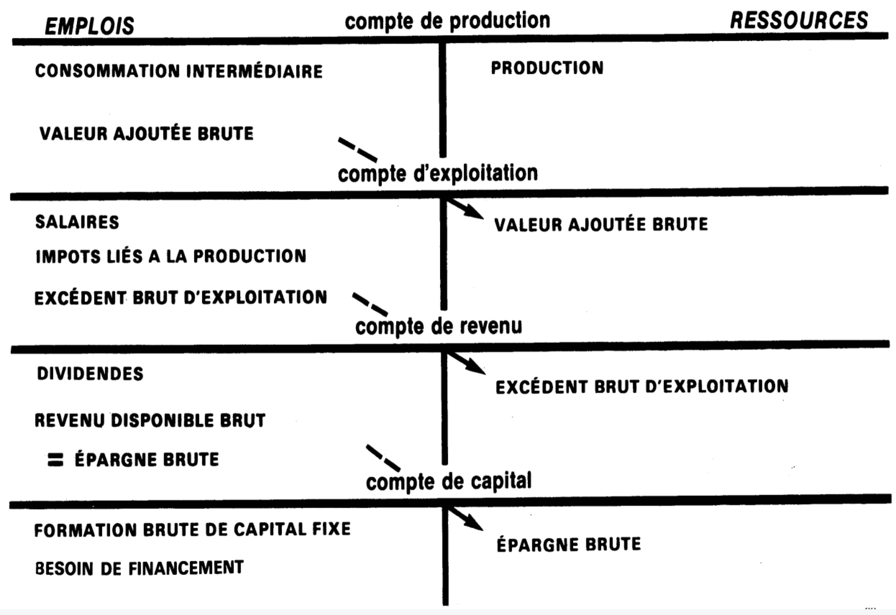

# 

### Ressources de la nation

### 1. Les ressources en produits

P: la quantité de biens et services tirée de l'activité productive nationale
国家生产的所有商品和提供的服务

M: biens et services importées du reste du monde(RDM)
国外进口的商品和服务

    Ressources = P + M = offres de biens et services

### 2. Les emplois en produits ou la demande de biens et services

demande intérieure + demande extérieure 内需+外需

demande intérieure:
* CF: la consommation finale des ménages(les dépenses effectivement réalisées par les ménages résidents pour acquérir des biens et des services destinés à la satisfaction de leurs besoins.)
* CI: la consommation intermédiare(byd教材写的interieure)（la production détruite au cours du processus de production c’est-à-dire des consommations intermédiaires）
* FBCF: la formation brute de capital fixe(固定资本形成总和，就是企业用于生产的长期资产)

    EMPLOIS = CF + CI + FBCF + X

Égalité entre l'offre et de la demande ====> Égalité entre les ressources et les emplois:

    P + M = CF + CI + FBCF + X

### Condition de l’équilibre emplois - ressources

假设 PIB = RN 国民生产总值 = 国民收入 = C + S

国民收入：是指一个国家在一定时间内（通常是一年）内由其国民创造的全部收入总和。国民收入包括工资、利润、利息和租金等各种形式的收入

La dépense nationale(DN) = dépense de consommation(个人消费支出) + investissement(投资之处) + 净出口

    DN = C + I + (X - M)

如果 RN = DN

    RN = DN
    C + S = C + I + (X - M)
    S - I = X - M
    L’équilibre emplois-ressources n’est possible que si S = I et X = M

外部盈余（X大于M）表示一个国家的出口超过进口，即国家在国际贸易中实现了贸易顺差。这意味着该国的出口创造了比进口更多的收入，因此国家的储蓄超过了国内的投资。

储蓄超过国内投资的情况意味着该国的居民或企业有较高的储蓄率，或者国内的投资需求相对较低。这可能导致国内的生活水平相对较低，因为储蓄并未用于满足国内的消费需求或投资需求。

然而，由于外部盈余，该国有债权（即拥有其他国家的债权）。这使得该国有能力将其储蓄投资于其他国家，包括进行外国直接投资（IDE）。通过在其他国家投资，该国可以获得更高的回报，并促进国内经济的发展。

相反地，当X低于M（即进口超过出口）时，意味着该国的投资超过了储蓄。这种情况下，该国的生活水平可能超出其经济能力，因为它需要通过借款来满足消费和投资需求。

### Calcul du PIB à partir de l’équilibre emplois ressources（新的计算GDP的方式）

考虑到使用-资源平衡，GDP可以用两种方式计算
P(la quantité de biens et services tirée de l’activité productive nationale) + M = CF(la consommation finale des ménages) + CI(consommation intermédiaire) + FBCF + X
    
    P - CI = (CF + FBCF) + (X - M)
    P-CI: 从产出角度看GDP的价值(生产的物品和提供的服务减去中间的成本消费)
    CF+FBCF: 国内最终使用的价值
    X- M: 表示贸易平衡
    CF+FBCF+X-M: 从需求方面计算GDP的公式。

再考虑关税(droits de douane)、增值税(TVA)和贸易差价(marges commerciales)

    PIB = P - CI + (TVA + DD) = (CF + FBCF) + (X - M)

### Les comptes des secteurs institutionnels et leur articulation

#### Le compte de production(生产)

它是经济中可用的商品和服务的来源。
Emplois: CI    Ressource
Le solde de compte de production是VA(Valeur ajouté)。它是衡量一个活动部门对创造财富的贡献的指标。

#### Le compte d'exploitation

其目的是核算不同经济主体，即雇员、企业主和国家之间对先前创造的VA的分享。

只有收入的主要分配被包括在这个账户中。EBE(税息折旧及摊销前利润, 通过比较收入和运营费用来衡量公司的运营绩效)是它的余额，它表明分配给企业管理者的收入份额，它象征着利润。

#### Le compte des revenus. d'utilisation du revenu et de capital

分配账户沿用前一个账户，它包括分配业务，并显示了从初级收入到可支配收入的过渡。
收入使用账户显示收入在消费和储蓄之间的分配。这个账户只涉及家庭。它的余额是储蓄总额。
资本账户将所有导致机构部门资产变化的业务集中起来。它是唯一有负余额的账户。这就被认为是一种融资需求。产生的储蓄不足以满足投资需求。在相反的情况下，该部门有融资能力。

#### ratios du TEE

Le taux d’investissement(投资率): indique la part de richesse nationale affectée à l’investissement.

    (FBCF / PIB) X 100

Le taux d’exportation(出口率): représente la part de la richesse nationale consacrée à l’exportation.

    (EXPORTATIONS / PIB) X 100

Le taux d’épargne des ménages(家庭储蓄率): il indique la part du revenu disponible des ménages affectée à l’épargne. 家庭可支配收入用于储蓄的部分

    ( EPARGNE BRUTE / PIB) X 100

Le taux de marge des SNF(利润率): un indicateur de la part de la valeur ajoutée conservée par les entreprises. 

    SNF = ( EBE / VA ) x 100

Le taux d’autofinancement: la capacité des entreprises à financer leur FBCF, Les entreprises doivent trouver des capitaux(去融资以募集资金) si ce ratio est inférieur à 100%

#### richess nationale应该用来干嘛？

### PIB, un indicateur controversé(GDP是一个衡量经济的有争议的指标)

* Le PIB peine à intégrer la valeur des biens et services produits pour être autoconsommés. GDP难以整合为自我消费而生产的商品和服务的价值，在GDP中它应该被归为VA的ressource. Pour les PED(发展中国家), cette mise à l’écart conduit à une sous-estimation conséquente de leur PIB（导致GDP被低估） L’autoconsommation constitue en effet une composante majeure de l’économie de ces pays.（L’autoconsommation是这些国家的重要组成部分）

    自己自足的经济模式，例如农耕经济，这些创造的价值没有被gdp考虑在内

* La seconde critique s’appuie sur la non prise en compte du travail au noir ou plus généralement de l’économie souterraine

    卖淫卖毒等地下产业创造的gdp没有被考虑在gdp中

* Une des contradictions du PIB découle du fait qu’il n’intègre pas les destructions de richesses consécutives à des évènements extraordinaires tels que des guerres ou des catastrophes naturelles. A l’inverse les dépenses engagées pour reconstruire sont prises en compte. L’après-guerre est de ce fait synonyme de croissance forte ( Trente glorieuses). Idem pour les catastrophes naturelles, même effet que les guerres, elles débouchent sur un gonflement du PIB.

    gdp不包括由于战争或自然灾害等非常事件造成的财富破坏, 由于重建而增长的GDP被考虑在内。因此，战后时期是强劲增长的代名词（Trente Glorieuses）

* Autre critique, le PIB n’apporte aucune indication sur la répartition des richesses

    一个拥有高GDP的国家也可能在其人口中存在贫困和苦难。财富分配不均

* Il n’est pas non plus un indicateur de bien-être.

    例如医疗费用带来的高GDP这项指标对普通百姓并不有利

* Le PIB repose sur une logique d’addition: tout se vaut, peu importe les conséquences sociales et environnementales!

    高gdp对社会和环境带来了危害，例如贩卖烟草带来的高gdp增长肯定是不好的

* Le PIB est un indicateur de flux , pas de stock. L’augmentation du PIB se fait généralement au détriment de la préservation de l’environnement et des stocks de matières premières disponibles.

    GDP是一个流量指标，而不是一个存量指标。国内生产总值的增加通常是以牺牲环境保护和原材料的可用库存为代价的。

* Le calcul du PIB repose sur des conventions discutables. C’est le cas de l’évaluation de la contribution des services collectifs ou non marchands. Ces derniers voient leur apport minorer du fait qu’ils sont évalués à partir des coûts de production nécessaire pour les produire ( quid de leur qualité)

* Les activités domestiques, le bénévolat, … sont aussi exclus du calcul du PIB

    家庭活动、志愿工作等也被排除在GDP的计算之外，因为它们具有非市场性质，尽管它们是集体福利或社会凝聚力的来源（Alfred Sauvy：一个与妻子结婚的律师有助于减少GDP的价值）

### Des indicateurs composites existent néanmoins

IDH(人类发展指数)

L’IDH s’est imposé à partir des années 80 comme un indicateur plus pertinent permettant de mettre en lumière le bien-être collectif. Son calcul intègre des critères qualitatifs: espérance de vie à la naissance, durées attendue et moyenne de scolarisation, revenu national par habitant.

它的计算包含了定性的标准：出生时的预期寿命、预期和平均的学校教育时间、人均国民收入。

Compris entre 0 et 1, l’IDH permet de mieux apprécier si les richesses produites profitent à tous et si elles permettent d’améliorer des conditions de 1.

可以更好地评估所产生的财富是否惠及每个人，是否允许改善生活条件。

Le classement des pays à partir de leur niveau IDH est assez proche du classement obtenu à partir du PIB par habitant. Il existe une corrélation entre le PIB par habitant, l’espérance de vie et le niveau d’instruction.

根据各国的人类发展指数水平进行的排名与根据人均国内生产总值获得的排名相当相似。人均GDP、预期寿命和教育程度之间存在着关联。

### Des indicateurs complémentaires au PIB

**ISS(社会健康指数)**: L’Indice de santé sociale (ISS), mesure le bien-être social de la société. C’est un agrégat de 16 indicateurs liés aux pathologies sociales.

社会健康指数（ISS）衡量社会的社会福利。它是与社会病态相关的16个指标的总和。

**BNB(不丹的国民幸福总值)**: L’indice de Bonheur National Brut du Bhoutan  (BNB) évalue les conditions sociétales, les moyens qui donnent le plus de chance de conduire la société vers un état de bonheur. Neuf critères sont pris en compte: bien-être psychologique, santé, usage du temps, éducation, bonne gouvernance , vitalité de la communauté,….

考虑了九个标准：心理健康、健康、时间利用、教育、善治、社区活力、....

**EE(生态足迹)**: L’Empreinte écologique (EE), indicateur synthétique qui mesure la pression exercée sur le capital environnemental par un individu ou un groupe d’individus en fonction de leur mode de consommation et de production.

衡量一个人或一群人由于其消费和生产模式而对环境造成的压力

**L’Empreinte carbone(碳足迹)**: Un indicateur composite agrégé permettant d’estimer les gaz à effet de serre (GES). I l équivaut au CO2 émis par la production de biens et services.

它相当于商品和服务的生产所排放的二氧化碳。

**L’Epargne nette ajustée(调整后的净储蓄)**: un indicateur de la Banque mondiale , il cherche à mettre en évidence le surplus de ressources dont dispose l’économie à l’issu d’un cycle annuel de production et de consommation, une fois compensée la dépréciation du capital économique, humain et naturel

计算方法是：从国民账户中得出的总储蓄（产出减去消费），减去固定资本的消费（经济资本的折旧），加上教育支出（重新归类为人力资本投资的消费），减去自然资产的损害（自然资本的折旧）。调整后的净储蓄以国民总收入的百分比表示。该指数越高，国家增加财富的能力就越强（广义）。 

### La répartition de la VA est-elle inégalitaire?

Un partage des richesses jugé inégalitaire : 

VA的分配是雇员和公司所有者之间不和谐的核心。大约2/3的资金用于雇员的报酬，近1/3用于资本的报酬。一个不断发展的划分被认为对劳动因素不太有利。
这种划分的转折点可以追溯到1983年，当时实施了将工资与通货膨胀脱钩的机制。其目的是为了打击通货膨胀的螺旋式上升，恢复价格竞争力，以改善法国经济的贸易平衡。这一措施在接下来的几十年里一直保持着，根据其反对者的说法，它导致了雇员购买力的下降，并造成了对雇员不利的VA分配。

### faut-il indexer les salaires en ces temps d’inflation?

**工资指数化**: 工人的货币工资随物价指数浮动，按照价格指数自动调节收入的一种工资制度

最低工资(SMIC)和退休人员的养老金(pension des retraités)是基于指数化的

En ces temps d’inflation croissante des voix se font entendre pour un retour du « système d’échelle mobile » basé sur l’indexation des salaires sur l’inflation. 

在这个通货膨胀上升的时代，有人呼吁恢复基于工资与通货膨胀挂钩的 "滑动等级制度"。

对于这一前景，有两个对立的阵营。一方面是左翼政治家和工会成员。另一方面是政府和雇主。
争论的焦点是什么？

Favorable: 
* Les profits engrangés n’ont jamais été aussi élevés ( Total, LVMH…les entreprises du CAC 40 s’en sortent bien ainsi que leurs actionnaires ) 利润从未如此之高（道达尔、LVMH......CAC40的公司都做得很好，他们的股东也是如此）。
* Les marges commerciales des entreprises ont considérablement augmenté. 公司的商业利润率已大大增加。
* En 30 ans, la part des salaires dans la valeur ajoutée a perdu 10 points de PIB. 30年来，工资在增加值中的份额已经失去了GDP的10个点。最低工资的不断重估往往使低工资更接近于最低工资（劳动人口变得更聪明的风险）
* Mesure de soutien à la consommation nécessaire au maintien de l’activité économique.指数化支持经济活动
 

Défavorable: 
* Une mesure porteuse d’un risque immédiat, le retour de **la boucle prix-salaires(工资价格环)** à l’origine de la spirale inflationniste ( métaphore du tube de dentifrice).
工资价格换环: 当工资水平上升时，员工的可支配收入增加，他们的购买力也相应增强。这可能导致需求增加，推动物价上涨。如果工资涨幅高于生产效率的增长，这可能会导致通货膨胀的螺旋上升

* L’indexation fait porter le coût de l’inflation sur les entreprises, risque de fragilisation du tissu productif. Les PME seraient les plus affectées.
指数化将通货膨胀的成本放在公司身上，有可能削弱生产结构。中小企业将受到最大的影响。

* 破产和裁员可能会导致，失业率可能会开始回升。
* 维持价格-工资环导致中央银行提高关键利率水平。
* 货币成本的增加不利于投资和经济的活力

Il n’existe pas de solution miracle en la matière tout compte fait.

Néanmoins l’Etat s’emploie à supporter une partie des surcoûts générés par l’inflation en adoptant en France un bouclier tarifaire. Mais cette mesure risque d’accroître le déficit public et l’endettement des pouvoirs publics.

Qui taxer pour financer la dette publique?

Les surprofits des entreprises? Les plus riches ?

L’indexation existe dans certains pays: le Luxembourg, la Belgique, Malte, Chypre. Quels effets ? Quelles conséquences? 

En Belgique, le patronat dénonce la mesure, car augmentation de salaires de 15 à 20% prévues sur la période 2022-2023.

FMI(国际货币基金组织)的结论: 

* La spirale prix-salaires ne se déclenche que dans de rares cas. 价格-工资螺旋只在极少数情况下被触发。

* les salaires nominaux augmentent mais jamais au même rythme que les prix 名义工资的上涨速度跟不上通货膨胀的速度。事实上，工薪族遭受了部分冲击，他们的实际工资下降

* Dès que l’inflation finit par se calmer, les salaires nominaux ont tendance à continuer à progresser et les salaires réels à se stabiliser. 一旦通货膨胀最终消退，名义工资往往会继续上升，而实际工资往往会稳定下来。

Des arguments qui confortent le camp de ceux qui plaident à cor et à cri la nécessité de revaloriser les salaires afin d’établir une meilleure répartition des richesses.
Au bout du compte, le rééquilibrage du partage de la valeur nécessite une action volontariste des pouvoirs via notamment le salaire minimum , la progressivité de l’impôt sur le revenu et la taxation des grandes fortunes.
这些论点加强了那些强烈主张需要提高工资以建立更好的财富分配的阵营。
最终，重新平衡价值分配需要当局采取积极行动，特别是通过最低工资、所得税的累进性和对大笔财富的征税。

### Faut-il réduire le niveau de la dépense publique ？

Le niveau élevé de la dépense publique n’est pas favorable à la soutenabilité des finances publiques. En cause, l’effet boule de neige du niveau de la dette qu’elle induit.

高水平的公共开支不利于公共财政的可持续性。原因是它引起的债务水平的雪球效应。

En effet dépense publique élevée implique déficits publics croissants. 

事实上，高额的公共开支意味着不断增长的公共赤字。

Deux modalités de financement possibles: accroître le niveau des PO et/ ou financement sur les marchés financiers via l’émission des emprunts obligataires.

有两种可能的融资方法：提高**PO(Prélèvement obligatoire)**和/或通过发行债券在金融市场上融资。

Dans le premier cas, on peut redouter des effets pervers : évasion fiscale, travail au noir, préférence pour les loisirs au détriment de l’activité productive…., . 

在第一种情况下，可以担心会有不正当的影响：逃税、不申报的工作、喜欢休闲而不是生产活动...., 。

Dans le cas d’un financement par émission d’obligations, on peut redouter un risque d’effet d’éviction au détriment des entreprises du fait de l’augmentation du niveau des taux d’intérêt. Il peut en résulter une baisse de l’investissement et de la croissance économique.

在债券融资的情况下，存在着通过提高利率排挤公司的风险。这可能导致投资和经济增长的下降。

L’accroissement de la dette publique du fait des déficits est jugée moralement inacceptable par les libéraux du fait qu’elle fait peser la charge de la dette sur les générations à venir. 

自由主义者认为，赤字导致的公共债务的增加在道德上是不可接受的，因为它把债务的负担放在了后代身上。

La baisse de la dépense publique permet d’accroître la crédibilité des pouvoirs publics sur les marchés financiers et d’améliorer les conditions de leur financement.

降低公共开支可以提高政府在金融市场上的可信度，改善政府的融资条件。

En somme, l’ensemble de ces préconisation repose sur l’idée qu’il s’agit de « gérer l’argent public en bon père de famille » afin de permettre une meilleure allocation des ressources.

简而言之，所有这些建议都是基于这样的想法：公共资金应该 "以负责任的方式管理"，以便更好地分配资源。

