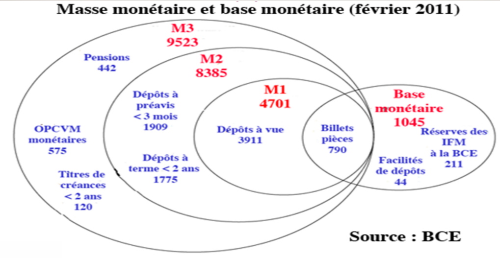
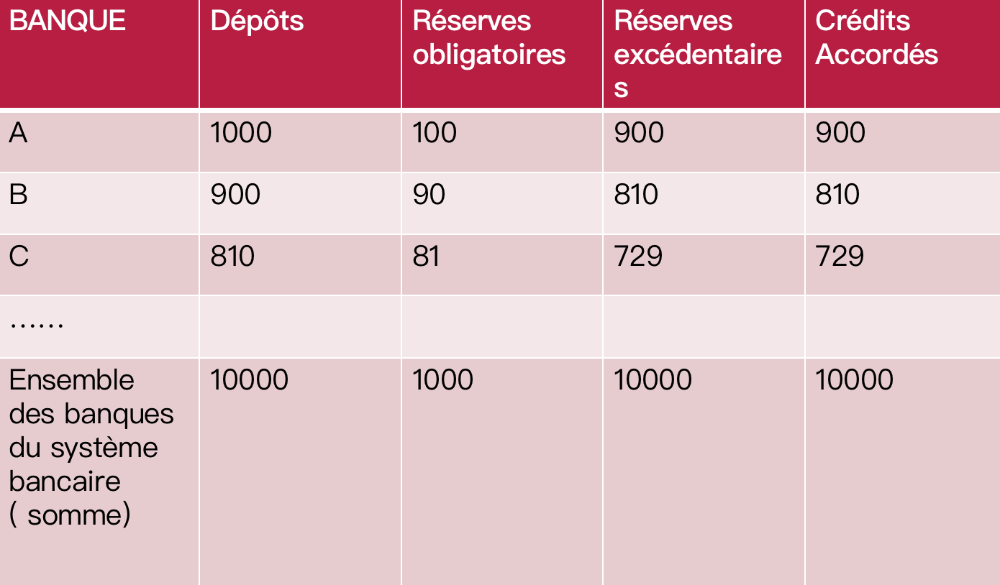

troc(以物易物)
交易成功的成本太高

monnaie
Trois qualités leur sont créditées pour assurer la fonction de monnaie: 
* elles sont acceptées par tous
* elles facilitent les échanges
* elles sont non périssables

# A quoi sert la monnaie

## fonction économique 经济作用

elle remplit simultanément: 
* le fonction d’unité de compte

La monnaie joue le rôle d’unité de compte ou d’étalon de valeur en permettant d’exprimer la valeur de tous les biens et services dans une unité commune ( l’euro ou le dollar) 使所有的商品和服务的价值都可以用一个共同的单位来表示

Elle permet de ce fait la comparaison des valeurs des biens entre eux, et facilite ainsi le calcul économique en évitant les multiples prix relatifs qu’impliquent le troc.
因此，它允许商品的价值相互比较，从而避免了以物易物中的多种相对价格，促进了经济计算。

La monnaie permet une double coïncidence des besoins, en permettant l’échange des biens contre de la monnaie (vente) et l’échange de la monnaie contre des biens ( achat). 货币通过允许用货物换取货币（销售）和用货币换取货物（购买），实现了需求的双重重合。

* le fontion d’intermédiaire des échanges 

C’est un facilitateur des échanges et un facteur de leur développement. Dans une économie caractérisée par des activités très diversifiées, la monnaie se révèle indispensable car elle favorise la spécialisation des agents économiques et l’augmentation de leur efficacité productive. Ces différents éléments mettent en lumière le rôle d’intermédiaire des échanges de la monnaie.

它是贸易的促进者，也是贸易发展的一个因素。在一个以高度多样化活动为特征的经济中，货币被证明是不可或缺的，因为它促进了经济主体的专业化，提高了他们的生产效率。这些不同的因素突出了货币作为贸易中介的作用。

* le fonction de réserve de valeur

La monnaie joue enfin le rôle de réserve de valeur, car elle permet de conserver la valeur au cours du temps. C’est un instrument d’épargne, , elle permet de différer la consommation, de faire face à des dépenses imprévues. C’est un actif sans risque ( pas de risque d’insolvabilité, ni d’illiquidité), un actif patrimonial parfaitement liquide. 

货币扮演着价值储存的角色，因为它使价值能够长期保留。它是一种储蓄工具，允许推迟消费和满足不可预见的费用。它是一种无风险的资产（没有破产或不流动的风险），是一种完全流动的世袭资产。

La fonction de réserve de valeur est remise en cause en période d’inflation. Elle devient un étalon instable. Il en résulte des comportements de fuite devant la monnaie ( l’hyperinflation allemande en 1922-1923 causée par le recours de la planche à billets pour financer les dommages de guerre de la Grande Guerre )

在通货膨胀时期，价值储备功能会受到质疑。它成为一个不稳定的标准。其结果是逃离货币（1922-1923年德国的恶性通货膨胀是由于使用印钞机为大战的战争损失提供资金而引起的）。

## fonction sociales

社区归属感。。。。。

* La monnaie facteur de pacification, évite la violence lors des échanges

* Pour Le sociologue allemand Georg Simmel, la monnaie est un instrument au service de l’émancipation des individus

* La monnaie facteur de puissance ou de pouvoir dans la société

* Pour les marxistes, la monnaie doit être analysée comme un rapport social. Elle déguise en réalité un rapport social d’exploitation entre les capitalistes et les travailleurs. La monnaie permet en effet aux bourgeois d’extorquer la plus value générée par la classe ouvrièr

对于马克思主义者来说，必须把货币作为一种社会关系来分析。它在现实中掩盖了资本家和工人之间的社会剥削关系。货币使资产阶级能够敲诈工人阶级产生的剩余价值。

## fonctions politiques

La monnaie en tant enjeu de pouvoir joue un rôle politique de premier plan.
Son rôle est de fédérer les citoyens autour de valeurs communes proclamées. 

作为一个权力问题，金钱起着关键的政治作用。
它的作用是将公民团结在宣称的共同价值观周围。

La monnaie véhicule un sentiment identitaire. Les billets portent souvent les traces d’une histoire ou d’une culture partagée au coeur d’une nation.

货币传达了一种身份感。纸币往往带有一个国家核心的共同历史或文化的痕迹。

La monnaie est garantie par une autorité politique, instaurée par la confiance en la société et ses institutions

货币由一个政治权威保证，通过对社会及其机构的信任而建立。

C’est un instrument au service du pouvoir politique via le monopole de l’émission et de la gestion de la monnaie légale. Elle sert au financement des dépenses publiques et régule l’activité économique.

它是一种通过垄断法定货币的发行和管理为政治权力服务的工具。它的作用是为公共开支提供资金并调节经济活动。

C’est aussi un instrument de puissance et de domination au service des Etats. Le rôle joué par le dollar depuis la fin de la Seconde Guerre mondiale en atteste «  le dollar c’est notre monnaie mais votre problème » avait affirmé un secrétaire d’état américain dans les années 70、、

它也是为国家服务的权力和统治的工具。自第二次世界大战结束以来，美元所扮演的角色证明了这一点："美元是我们的货币，但却是你们的问题"，一位美国国务卿在20世纪70年代如是说；

# La Création monétaire

## LA CREATION MONETAIRE PAR LES BANQUES DE SECOND RANG: CADRE D’ANALYSE ET MODELE MULTIPLICATEUR(二级银行的货币创造)

Il y a création monétaire lorsque les moyens de paiement en circulation dans l’économie augmente, d’autres termes lorsque la masse monétaire s’accroît.

### les principaux agents impliqués dans la création monétaire:

* Les agents privés ( ménages, SNF) participent à ce processus via la demande de crédits 私人代理人通过信用贷款参与这一过程

* Les banques commerciales de second rang via leur politique en matière d’octroi de crédits 二级商业银行通过其贷款政策参与这一过程

* Les banques centrales ou de premier rang dont la vocation est d’être la banque des banques. 中央银行或一级银行

### Les crédits font les dépôts, principal central à l’origine de la création monétaire(贷款方进行存款):

* Les banques créent de la monnaie à partir de rien, un simple jeu d’écriture suffit. 银行凭空创造货币,这是一种凭空创造货币的行为，不需要任何资源就可以授予信贷，银行发放信贷来自于相信这个词，因为债务人，有一个还款承诺

* L’octroi de crédits a des implications sur les bilans des acteurs impliqués. 贷款的发放对资产负债表有影响

###  Le crédit, la source principale de création monétaire

Chaque  crédit octroyé par la banque se traduit par une augmentation de la quantité de monnaie en circulation.

银行发放的每一笔贷款都会导致流通中的货币数量增加

### Les autres sources de création monétaire

* Il y a aussi création monétaire dès lors qu’une banque commerciale achète un actif qui n’est pas de la monnaie ( immeubles, actions,..) et qu’elle crée de la monnaie nécessaire au règlement de cette transaction. 
当商业银行购买不是货币的资产（房地产、股票等）并创造出结算交易所需的货币时，货币也会被创造出来。

* Lorsqu’une banque monétise un actif  non monétaire ( opération d’escompte d’une lettre de change)
当银行将非货币资产货币化（贴现汇票）时

* Lorsque les banques acquièrent des titres publics
当银行收购政府证券时

## La création monétaire

### La création monétaire par les banques de second rang: cadre d'analyse et modèle multiplicateur

货币供应量(la masse monétaire)增加的时候，就会产生货币

les principaux agents impliqués dans la création monétaire：
* Les agents privés ( ménages, SNF) participent à ce processus via la demande de crédits（家庭、公司SNF）
* Les banques commerciales de second rang via leur politique en matière d’octroi de crédits（商业银行）
* Les banques centrales ou de premier rang dont la vocation est d’être la banque des banques.（央行）

### Les crédits font les dépôts, principE central à l’origine de la création monétaire 贷款产生存款，货币创造的核心原则

* Les banques créent de la monnaie à partir de rien, un simple jeu d’écriture suffit. 银行凭空创造货币，只需要把它写下来
* Il s’agit d’une création monétaire ex nihilo: aucune ressource n’est nécessaire pour accorder un crédit. 钱是凭空创造的，发放贷款不需要任何资源
* L’octroi d’un crédit par la banque vient du mot « croire car il y a une promesse de remboursement de la part du débiteur, celui qui demande crédit. 银行因为相信经济主体会还款所以发放信贷，贷款人有一个偿还的承诺
* La création monétaire est une réponse à la demande de crédits de la part des agents économiques. 货币创造是对经济主体的信贷需求的回应
* L’octroi de crédits a des implications sur les bilans des acteurs impliqués. 信贷的发放对相关参与者的资产欠债表有影响

###  création monétaire dans le cas d’une banque unique

L’entreprise Soft est à court de trésorerie, elle sollicite un crédit à sa banque, le LCL , d’un montant de 100.000 euros. Soft公司缺钱，就向LCL银行申请课100000euros

Cette demande de crédit va induire des modifications au niveau du bilan de la banque LCL et de son client, l’entreprise Soft. 资产负债表发生变化

    Bilan LCL
    Actif            Passif
    Credit:100000    DAV:100000
    Total:100000     Total:100000

    Bilan Soft
    Actif            Passif
    Avoirs:100000    Dette:100000
    Total:100000     Total:100000

### Le crédit, la source principale de création monétaire

L'actif et le passif des deux acteurs augmentent simultanément(资产和负债同时增加)LCL是soft的债权人，soft是债务人

Chaque  crédit octroyé par la banque se traduit par une augmentation de la quantité de monnaie en circulation. En effet, les crédits accordés se transforment en dépôts sur les comptes clients en vertu de la logique selon laquelle « les crédits font les dépôts ». 银行发放的每笔贷款都会导致流通中的货币数量增加。因为所发放的贷款被转化为客户账户上的存款

Le crédit constitue ainsi la principale source de création monétaire scripturale. 信贷是货币创造的主要来源

### Les autres sources de création monétaire

* Il y a aussi création monétaire dès lors qu’une banque commerciale achète un actif qui n’est pas de la monnaie ( immeubles, actions,..) et qu’elle crée de la monnaie nécessaire au règlement de cette transaction. 当商业银行购买不是货币的资产（房地产、股票等），并创造出结算交易所需的货币时，也会创造货币。

* Lorsqu’une banque monétise un actif  non monétaire ( opération d’escompte d’une lettre de change) 银行将非货币资产货币化（将lettre de change贴现）

#### Lettre de change

汇票是一种金融工具，用于支付货款或作为债务的担保。它是由一方（出票人）发行给另一方（收款人）的一种书面承诺，承诺在特定日期或在要求时支付一定金额的货款。

商人和客户签署了一份5000欧的汇票，要求客户在三个月后支付其购买的商品的5000欧，一个月后商人面临现金流的问题，要求银行为其汇票贴现，银行就将汇票货币化，将资金预付给商人，但需要按taux d'escompte（贴现率）向商人收取一定费用

### Les autres sources de création monetaire

* Lorsque les banques acquièrent des titres publics. Il s’agit des concours apportés par les banques aux administrations publiques ( crédits contractés ou émission de titres de créance ( bons du Trésor pour financer la dette))

银行持有国债

Lorsque les banques détiennent des créances sur l’extérieur, cette situation se produit en deux circonstances, d’une part , lorsque les agents non résidents échangent des devises contre de la monnaie nationale à l’occasion par exemple d’une opération d’exportations de biens ou de services, d’autre part, lorsque les banques commerciales achètent des titres qu’émettent des agents non- résidents. 

银行持有外债，发生在两种情况下，非居民代理人将外币兑换成本国货币，例如在出口货物或服务时；当商业银行购买非居民代理人发行的债券时

### Création monétaire dans le cas d’un système bancaire diversifié

假设soft在获得贷款后从alpha公司购买了价值60000欧元的货物。alpha公司在SG有一个账户

    Bilan LCL
    Actif                                Passif
    Crédit à l'entreprise Soft:100000    DAV Soft:40000
                                         Dette envers SG:60000
    Total:100000                         Total:100000

    Bilan SG
    Actif                                Passif
    Créance sur la banque LCL:600000     DAV Alpha:60000
    Total:60000                          Total:60000

### Le processus de compensation interbancaire

Le paiement de l’entreprise Soft à l’entreprise Alpha a pour conséquence le transfert de 60000 euros de la banque LCL vers la banque SG. 
La banque LCL se retrouve débitrice de 60000 euros à l’égard de la banque SG. Elle doit s’acquitter de cette dette dans le cadre des opérations de compensation interbancaire lesquelles implique une intervention de la banque centrale.
Ce règlement s’effectue en monnaie centrale. Ce processus est facilité par le fait que les banques commerciales possèdent un compte auprès de la banque centrale.
Ce compte apparaît à l’actif des banques de second rang.

Soft公司向Alpha公司的付款导致60,000欧元从LCL公司转移到SG公司。
LCL银行欠SG银行60,000欧元。它必须通过涉及中央银行干预的银行间清算交易来结算这笔债务。
结算是以中央货币进行的。由于商业银行在中央银行有一个账户，这一过程得到了便利。
这个账户出现在二级银行资产负债表的资产一侧。

### Le règlement interbancaire implique la banque centrale

    Bilan LCL
    Actif                                Passif
    Crédit à l'entreprise Soft:100000    DAV Soft:40000
    Compte à la banque centrale:-60000                                   
    Total:40000                          Total:40000

    Bilan SG
    Actif                                Passif
    Compte à la banque centrale:+600000  DAV Alpha:+60000
    Total:60000                          Total:60000

### le rôle de la banque centrale dans la création monétaire

中央银行时银行的银行，商业银行被置于中央银行的监管之下

Elle incarne l’autorité monétaire par excellence en assurant de multiples fonctions:

* elle a le monopole de l’émission des billets et des pièces. C’est le  Trésor ( l’Etat) qui en France assure la fabrication des pièces, celles-ci sont ensuite vendues à la banque centrale qui se charge de les faire circuler.

它对纸币和硬币的发行拥有垄断权，财政部制造硬币和纸币，卖给中央银行，由其负责流通

* La banque centrale gère les réserves de change管理外汇储备
* Elle joue le rôle de prêteur en dernier ressort notamment en période de crise systémique 充当最后的贷款人，特别是在系统性危机的时候
* Elle intervient sur le marché monétaire en apportant de la liquidité ( opération d’open market) ( voir schéma) 提供流动性来干预货币市场
* Elle s’occupe de la gestion des comptes courants des banques de second rang domiciliés en son sein . 管理商业银行在央行注册的账户

---
    Bilan de la banque centrale

    Actif                                           Passif
    Devise et or(货币和黄金)                          Billets en circulation（流通中的货币）
    Créances sur le système bancaire(银行的债券)      Réserves obligatoires(储备金)
    Titres publics(公共证券)                          Réserves excédentaires(盈余储备金)

### La monnaie banque centrale

Le passif de la banque centrale est constitué de la monnaie centrale ou monnaie banque centrale. Elle comprend les billets ou la monnaie fiduciaire en circulation ainsi que les réserves obligatoires.

中央银行的负债由中央货币或中央银行货币组成。它包括流通中的钞票或货币以及储备金要求。

L’actif de la banque centrale constitué par l’ensemble de ses avoirs décrit les modalités de la création monétaire par la banque centrale.

中央银行的资产由其持有的所有资产组成，描述了中央银行如何创造货币。

La monnaie créée par la banque centrale est la seule acceptée pour les règlements interbancaires

中央银行创造的货币是银行间结算所接受的唯一货币。

### Les intruments de la banque centrale pour influencer la création monetaire 

La banque centrale peut influencer l’ampleur de la création en mobilisant différents  instruments:

Il y a d’abord, le taux directeur ou taux de refinancement : il s’agit du taux d’intérêt fixé par une banque centrale pour les prêts accordés (en liquidité) aux banques de second rang en besoin de liquidités en échange de titres mis en garantie ( actions, obligations) . Ce taux est central dans la conduite de la politique monétaire. Il est le baromètre du crédit. Son relèvement dissuade le crédit tandis sa diminution le stimule.

首先是基准利率或再融资利率：这是由中央银行设定的利率，用于向二级银行提供流动性贷款，以交换抵押的证券（如股票、债券）。这个利率在货币政策的执行中非常重要，它是信贷的晴雨表。如果该利率上调，会抑制信贷活动，而下调则会刺激信贷。

Il y a ensuite  le taux de dépôt, il correspond aux intérêts appliqués à la somme placée et reversée aux banques commerciales.

其次是存款利率，它是应用于存款并支付给商业银行的利息。

Le taux de prêt marginal s’applique quand une banque a besoin de liquidités. Ces prêts sont quotidiens et doivent être remboursés le jour suivant, contrairement aux taux de refinancement qui est hebdomadaire.

边际贷款利率适用于银行需要流动性的情况。这些贷款是按日计息的，必须在次日偿还，与再融资利率不同，再融资利率是按周计息。

Le taux de facilité de prêt marginal s’applique donc dans le cadre des liquidités que la banque centrale apporte au jour le jour ( soit 24 heures) aux banques commerciales en échange de titres.

边际贷款利率适用于中央银行提供给商业银行的每日流动性，交换条件是商业银行提供抵押品。商业银行可以在银行间市场（即隔夜资金市场）上向其他二级银行融资。当日的利率水平在很大程度上受到中央银行基准利率的影响。

Les banques commerciales peuvent se financer auprès d’autres banques de second rang sur le marché interbancaire ( marché de l’argent au jour le jour). Le taux d’intérêt en vigueur sur ce jour est largement influencé par le taux directeur de la banque centrale.

商业银行在进行日常经营活动时需要保持一定比例的准备金存款，这是根据中央银行规定的比例计算的。这意味着商业银行只能使用剩余的存款进行贷款和投资活动，而非全部存款。中央银行可以通过调整强制准备金率来控制商业银行的可贷资金量，从而对货币供应产生影响。

En plus du taux directeur, la banque centrale dispose d’un second instrument permettant de contrôler la création monétaire, il s’agit des réserves obligatoires ( vu précédemment)

强制准备金和边际贷款利率是中央银行运用的两种主要工具，用于管理银行体系中的流动性和货币供应。通过调整这些工具，中央银行可以影响银行体系的借贷活动、市场流动性以及整体经济的运行。需要注意的是，不同国家和地区的中央银行可能会有不同的政策和工具来管理货币供应和市场流动性，以适应本国的经济和金融体系。

### Les RO limitent la capacité des banques à créer de la monnaie

Il en découle le fait que plus le taux de RO est élevé, plus la capacité des banques à accorder de nouveaux crédits est faible ( inversement).

Lors de crises économiques ou de morosité économique, les banques centrales procèdent généralement à une baisse des taux directeurs et du taux de RO afin d’inciter les banques à créer davantage de monnaie pour les besoins de relance économique.

### Les limites à la création monétaire

Le pouvoir de création monétaire est limité et encadré.

Il est limité du fait des retraits des billets effectués par les clients sur leurs dépôts; les banques doivent se les procurer sur le marché monétaire moyennant un taux d’intérêt ou les retirer sur leurs dépôts auprès de la banque centrale.

La seconde limite découle des contraintes imposées par les RO, constitués de dépôts non rémunérés auprès de la banque centrale. 

### La destruction monétaire et la création nette de monnaie

la destruction monétaire accompagne la création monétaire : A toute opération de création monétaire est associée une opération de destruction monétaire. Celle-ci intervient lorsque:

货币毁灭伴随着货币创造：每个货币创造操作都与货币毁灭操作有关。这发生在以下情况：

Le débiteur rembourse le crédit initialement octroyé par la banque

Il y a une opération d’importation: l’importateur est généralement tenu de payer son fournisseur en devises. Il est ainsi conduit à convertir une certaine quantité de monnaie nationale en devises ( des euros contre des dollars par exemple). Cette opération de conversion se traduit par une diminution des euros en circulation.

有一笔进口交易：进口商一般有义务用外币向其供应商付款。因此，进口商必须将一定数量的本国货币转换成外币（例如，欧元转换成美元）。这种转换操作会导致流通中的欧元数量减少。

### La création nette de monnaie dépend de la conjoncture économique

Au final la création nette de monnaie est la différence entre la création monétaire et la destruction monétaire.

Elle est tributaire de la conjoncture économique. La création nette de monnaie est plus élevée en période de croissance économique. Les anticipations positives des agents économiques favorisent la demande de crédits à des fins de consommation et d’investissement. 

A l’inverse, lorsque la conjoncture est morose , la création nette de monnaie est plus faible.

最后，净货币创造是货币创造和货币毁灭之间的区别。
它取决于经济环境。在经济增长的时期，净货币创造量较高。经济主体的积极预期鼓励了对消费和投资目的的信贷需求。
相反，当经济不景气时，净货币创造就会降低。

### les agrégats monétaires et les contreparties de la masse monetaire

les agrégats monétaires, un instrument de mesure de la masse monétaire: Mesurer la quantité de monnaie en circulation dans l’économie est d’un intérêt crucial. 

货币总量，衡量货币供应量的工具

Les agrégats permettent de mesurer la quantité de monnaie en circulation mais aussi de classer les formes de monnaie selon un degré de liquidité.
Dans le cadre de la zone euro, trois agrégats monétaires ont été définis: M1, M2, M3

总量使得衡量流通中的货币数量成为可能，同时也可以根据货币的流动性程度对其进行分类。
欧元区已经定义了三种货币总量：M1、M2、M3。

L’agrégat monétaire M1 mesure la monnaie au sens strict. Il inclut les billets et les pièces, les dépôts à vue ( des ménages, des entreprises, des administrations publiques,..). Il s’agit en somme de l’ensemble des moyens de paiement utilisés par les agents économiques.

L’agrégat monétaire M2 inclut M1et les dépôts considérés comme de la quasi-monnaie, il regroupe tous les actifs financiers qui peuvent être transformés en moyen de paiement immédiat . Il s’agit des dépôts à terme inférieurs à deux ans ( les comptes à terme par exemple), des dépôts avec préavis inférieurs à trois mois, ce sont des placements non risqués et disponibles à vue ou immédiatement ( livret A, livre de développement durable, livret d’épargne….)

M1（狭义货币）：M1是最窄的货币总量指标，主要衡量货币的狭义定义。它包括以下部分：

* 纸币和硬币：流通中的现金货币。
* 即期存款：包括家庭、企业、政府等机构的即时可用存款。它们是经济主体日常交易和支付所使用的货币。

M2（准货币）：M2是较宽的货币总量指标，除了包括M1的内容外，还包括被视为准货币的存款。具体包括：

* M1：即M1的定义，包括现金货币和即期存款。
* 期限在两年以下的定期存款：指存款在规定期限内无法提前支取的存款，例如定期存款账户。
* 通知期限在三个月以下的存款：指可以在规定的通知期限内支取的存款，如法定通知存款。
* 其他类似的流动性较高、较低风险的储蓄和投资工具，如法定储蓄（livret A）、可持续发展储蓄（livret de développement durable）、储蓄存款账户等。

M3（广义货币）：M3是最宽的货币总量指标，涵盖了M2的范围，并且还包括了较不易流通的货币部分。具体包括：

* M2：即M2的定义，包括M1、定期存款和通知存款。
* 向央行质押的养老金或债券：指向央行交换现金的抵押品，例如养老金资产或债券。
* 期限在两年以下的债券和证券：指期限在两年以内的债券和金融证券。
* 其他类似的较长期限、较不易流通的金融工具，如开放式投资基金的股票等。

M1, M2, M3 , constituent la masse monétaire, elle indique l’ensemble des moyens de paiement dont disposent les agents économiques pour effectuer des transactions de le cadre des échanges marchands.

M1、M2和M3构成了货币供应量，它表明经济主体在贸易中进行交易的所有支付手段。

Le contrôle de la masse monétaire revêt une importance cruciale car il permet aux autorités monétaires de mieux cibler la politique monétaire.

控制货币供应量是至关重要的，因为它使货币当局能够更好地确定货币政策。

Les autorités monétaires peuvent augmenter ou diminuer la masse monétaire en agissant sur la base monétaire appelée parfois M0. Celle-ci désigne la monnaie créée par une banque centrale qu’on appelle également monnaie centrale ( billets pièces, RO) 

货币当局可以通过作用于货币基础（有时称为M0）来增加或减少货币供应。这指的是中央银行创造的货币，也被称为货币基础（纸币、硬币、RO）。

### Les contreparties de la masse monétaire

La masse monétaire correspond à des engagements des institutions monétaires financières auprès des agents économiques non financiers. Ces engagements figurent ainsi au passif de ces agents. Ils sont associés à des contreparties qui , elles, figurent à l’actif des institutions monétaires et financières. Ces contreparties sont les sources de la création monétaire. 

On distingue ainsi trois contreparties de la masse monétaire : les avoirs extérieurs nets, les créances nettes sur l'Etat et les crédits à l'économie. 

Les créances nettes sur l'extérieur : Les entrées de devises étrangères au sein d'un pays augmentent la masse monétaire. On prend alors en compte l'ensemble des devises détenues par les instituions financières. L'or est également une contrepartie.

Le crédit interne net : Ce sont les créances sur le trésor public détenues par la banque centrale. L'Etat peut décider d'émettre de nouveaux billets ou pièces de monnaies. Dans ce cas, la banque centrale fait tourner la planche à billets et en contrepartie, elle dispose d'une créance sur le trésor public. Ces créances sont une contrepartie mineure dans la création monétaire. De plus, le trésor public n'est pas à l'origine des décisions de l'augmentation de la masse monétaire. C'est la banque centrale qui décide de la politique monétaire à adopter en fonction du niveau des différents agrégats monétaires souhaité.

Les créances sur l'économie : Ce sont l'ensemble des crédits accordés aux agents économiques par les banques .  En effet faire crédit , c'est accorder un pouvoir d'achat qui à la base n'existait pas.

### Le mutiplicateur et le diviseur de crédit

le mécanisme du multiplicateur: Il a pour intérêt d’expliquer la capacité du système bancaire à augmenter de manière plus que proportionnelle la quantité de monnaie créée. Il met en lumière la relation entre la monnaie centrale et la monnaie créée par les banques de second rang.

乘数机制：这解释了银行系统超过比例地增加货币创造量的能力。它强调了货币基础和二级银行所创造的货币之间的关系。

Pour expliquer le mécanisme, il faut partir d’un certain nombre de données. Supposons qu’un client de la banque LCL demande crédit de 1000 euros et obtient l’accord de la dite banque.  Ces 1000 € de crédit se transforment en 1000 € de dépôt. Supposons que le taux de RO ( réserves obligatoires) encore appelé coefficient de réserve est de 10%. La banque doit alors alimenter son compte à la banque centrale pour un montant de 100€.  La banque  dispose  donc de 900 € de réserves excédentaires, elle va pouvoir les utiliser pour octroyer de nouveaux prêts.

为了解释这个机制，我们需要从一定量的数据开始。假设LCL银行的一个客户要求1000欧元的信贷，并获得了上述银行的同意。 这笔1000欧元的贷款被转换为1000欧元的存款。我们假设RO（准备金要求）比率，也被称为准备金率，是10%。然后，该银行必须在其在中央银行的账户中存入100欧元。 因此，银行有900欧元的超额准备金，它可以用来发放新贷款。

Ces 900€ de crédit créent 900 € de dépôt dans une banque B . Tout comme la précédente, la banque B doit alimenter son compte à la banque centrale de 90 euros, et le reste c’est-à-dire 810€ vont servir de réserves excédentaires. Celles-ci n’étant pas rémunérées par la banque centrale serviront à la banque B pour accorder de nouveaux prêts.

这900欧元的贷款在B银行创造了900欧元的存款。就像前一家银行一样，B银行必须在其在中央银行的账户中增加90欧元，其余的，即810欧元，将被用作超额储备。由于这些储备金没有得到中央银行的报酬，它们可以被B银行用来发放新贷款。

Ces 810 € de crédits vont se traduire en dépôts au profit d’une banque C. Celle-ci va devoir constituer des RO d’une valeur de 81€, il lui restera alors des réserves excédentaires de 729 € qui servent à accorder de nouveaux prêts…

这些810欧元的贷款将转化为有利于C银行的存款。这家银行将不得不建立价值81欧元的投资回报率，留下729欧元的剩余储备，它可以用来发放新的贷款......

Le processus de création monétaire se poursuit et se reproduit de manière identique infiniment.
La quantité de monnaie créée au final peut-être évaluée. 

货币创造过程继续进行，并以同样的方式无限复制。
最终创造的货币数量可以被计算出来。

        En constatant que 900 = 1000 ( 1- 10%), que 810 = 1000 ( 1-10%)(1-10%), que 
        729 = 1000 ( 1-10%)(1-10%)(1-10%)
        La somme précédente peut s’écrire de la manière suivante:
        1000 + 1000(1-10%) +1000(1-10%)(1-10%)+1000(1-10%)(1-10%)(1-10%)+....
        Soit 1000 [ 1+(1-10%)+(1-10%)²+ (1-10%)³+……]
        = lim 1000( 1- (0.9))^n / (1- 0.9)
          n→∞
On est en présence d’une suite géométrique de premier terme 1000 et de raison 0.9
La lim de cette suite à l’infini est de 10000
Les 1000 € de dépôts initiaux ont ainsi permis au système bancaire de générer une création monétaire de 10000 €, soit une quantité de monnaie multipliée par 10.
En notant R le coefficient de réserves obligatoires, on peut déterminer l’expression du multiplicateur de crédit noté M
M= 1/R

Ce multiplicateur de crédit indique que chaque euro de dépôt peut générer 1/R euro de monnaie supplémentaire. 
Dans l’exemple précédent, le multiplicateur de crédit est égal à 1/0.1 = 10.

### Generalisation et modelisation du modele

    Soit A le dépôt initial et R le taux de RO, il est possible de calculer le supplément de monnaie créée, soit ∆M de la manière suivante:

    ∆M = A+ A ( 1-R)+ A(1-R)²+A(1-R)³+……….+ A(1-R)n
    ∆M est une suite géométrique dont la somme est égale à S = A[1−(1−R)n/1−(1−R)
    Lorsque n →∞, cette somme est égale à A/1−(1 −R) = A1/R = AM
    Avec M = 1/R = 1/1−(1−R)

### LE modele du multiplicateur de credit

Les banques sont confrontées à deux fuites: les réserves obligatoires et les retraits de billets. En tenant compte de cette réalité, supposons à présent que:
- la masse monétaire , notée M est composée des billets, notés B et des dépôts à vue notés D: On a ainsi M = B + D

货币供应量 现金+活期存款

La base monétaire , notée H, qui par définition correspond au passif de la banque centrale est composée des billets B et des réserves obligatoires notées RO. 
Dès lors H = B  + RO

货币基础 中央银行的负债,包含现金和存款准备金

货币发行（Currency in Circulation）：这是指由央行发行并流通于公众手中的纸币和硬币的总额。它代表了公众持有的现金，可以用于日常交易。

存款准备金（Reserves）：这是商业银行在央行保留的存款，以满足存款准备金要求。存款准备金是商业银行持有的现金储备，以应对客户提取现金或满足支付结算需求。

货币基础在货币供应链中起着关键的作用。它为商业银行创造货币提供了基础，因为商业银行可以利用存款准备金进行贷款和信用活动。货币基础的规模和增长对经济和货币政策具有重要影响。央行通过控制货币基础的供给来实施货币政策，以达到宏观经济管理的目标，例如控制通胀、促进经济增长等。

Les RO correspondent à une fraction r des dépôts, soit RO = rD

Les billets représentent une proportion b de la masse monétaire, soit : 
    
    B = Bm

现金代表货币供应量的一个比例b，即 ： B = Bm

Dès lors, les dépôts constituent le complément à la masse monétaire. 存款构成了货币供应量的其余部分。

Soit 
        
    D =(1- b) M

On peut reécrire la base monétaire comme:
    
    H = B+RO =bM +rD= bM +r(1-b)M = M[(b+r(1-b)]

La relation entre la masse monétaire et la base monétaire est ainsi établie:

    M = H/b+r ( 1−b) = mH 
    avec m = 1/b+r(1−b) le multiplicateur de crédit.

La précédente équation montre qu’il existe une relation entre la masse monétaire et la base monétaire. Le multiplicateur de crédit mesure ainsi le rapport entre la masse monétaire et la base monétaire. Cette relation est fonction des facteurs de la liquidité bancaire.

前面的方程式表明，货币供应量和货币基础之间存在着一种关系。因此，信贷乘数衡量的是货币供应量和货币基础之间的关系。这种关系是银行流动性因素的一个函数。

Le modèle du multiplicateur de crédit est critiqué car il ne s’agit que d’une source de création monétaire, l’octroi de crédit, or il existe diverses sources de création monétaire, qui ne sont pas prises en compte par le modèle. Il ne tient pas non plus compte des fuites d’autres formes de monnaie ou placements.

信贷乘数模型被批评为只关注货币创造的一个来源，即发放信贷，而有各种货币创造的来源没有被该模型考虑在内。它也没有考虑到其他形式的货币或投资的流失。

### Banking school versus currency school

La notion de multiplicateur ou de diviseur de crédit renvoie à la question du caractère exogène ou endogène de la monnaie.

信用乘数或除数的概念是指货币是外生的还是内生的问题。

Cette question a divisé les économistes au cours du 19 eme siècle avec d’un côté les partisans de la Banking School ( l’école de la banque)et de l’autre ceux de la Currency School ( l’école de la circulation).

这个问题在19世纪的经济学家中产生了分歧，银行学派是一方，货币学派是另一方。

Pour les partisans de la Currency School, l’offre de monnaie est une variable exogène du fait que la masse monétaire est déterminée par les réserves préalables détenues par les banques de second rang auprès de la banque centrale. C’est donc elle qui en dernier ressort contrôle la création monétaire.

在货币学派看来，货币供应量是一个外生变量，因为货币供应量是由二级银行在中央银行持有的储备金决定的。因此，最终控制货币创造的是中央银行。

Les partisans de la Banking School contestent cette vision qui occulte le rôle des banques de second rang dans le processus de  création monétaire. En effet, ce sont elles qui via le crédit alimente la masse monétaire en circulation. Elles ont donc un rôle actif. Ainsi la relation précédente mise en lumière par le multiplicateur de crédit s’inverse. En accordant des crédits, les banques se retrouvent en situation de besoin de financement qui les oblige à se tourner vers la banque centrale. Dans ce cas, c’est la base monétaire qui s’ajuste à la variation de la masse monétaire. 

银行学派的支持者对这种观点提出异议，因为它掩盖了二级银行在货币创造过程中的作用。事实上，正是他们通过信贷为流通中的货币供应量提供资金。因此，他们发挥着积极的作用。因此，以前由信贷乘数所强调的关系被颠覆了。通过发放信贷，银行发现自己处于需要融资的境地，这迫使他们转向中央银行。在这种情况下，是货币基础根据货币供应量的变化进行调整。

Il découle de ce qui précède le diviseur de crédit, noté d, qui établit une relation entre la masse monétaire et la base monétaire  : H = 1/mM=dM 

这就产生了信贷除数，用d表示，它在货币供应量和货币基础之间建立了一种关系：H=1/mM=dM 

La monnaie est alors considérée comme endogène puisque le refinancement demandé par les banques de second rang à la banque centrale est une fraction 1/m du crédit qu^′elles ont préalablement accordé. C’est donc la vision de la Banking School.

然后，货币被认为是内生的，因为二级银行向中央银行申请的再融资是它们先前发放的信贷的1/m的一部分。这就是银行学派的观点。

Mathématiquement, les notions de multiplicateur et de diviseur de crédit sont assez proches, l’un étant égale à l’inverse de l’autre, elles apparaissent néanmoins comme le reflet de deux conceptions opposées de la monnaie et de son processus de création. Elles impliquent aussi des conceptions différentes en matière de conduite de la politique monétaire.

在数学上，乘数和信贷除数的概念非常相似，一个等于另一个的倒数，但它们似乎反映了对货币及其创造过程的两种对立概念。它们也意味着对货币政策行为的不同概念。

货币的外生性观点是指货币供应是由中央银行通过直接控制决定的，它是一个外部决定因素。按照这种观点，中央银行通过调整货币基础（通常是通过调整存款准备金率或进行开放市场操作）来直接影响货币供应量。乘数的概念与外生性观点相关，它表示基础货币变动对整个货币供应量的乘数效应。例如，如果存款准备金率为10%，那么每增加1单位的基础货币，最终货币供应量可能会增加10单位。

然而，货币的内生性观点认为货币供应量是由商业银行的信贷活动和需求决定的。商业银行通过向借款人提供贷款和发行存款来创造货币。根据这种观点，商业银行的信贷活动驱动货币供应的增长。在这种情况下，商业银行通过贷款创造的存款数量超过了它们持有的储备金数量。这就是除数的概念，它表示每单位的储备金可以支持的货币供应量。

从数学上讲，乘数和除数是相互倒数的关系。如果乘数为m，则除数为1/m。它们反映了对货币的不同理解和货币创造过程的两种观点。这些观点也导致了在货币政策的实施上的不同看法。

