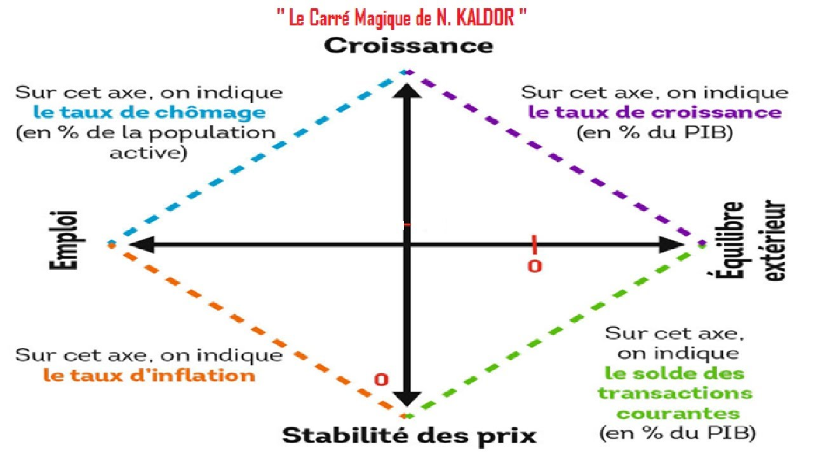
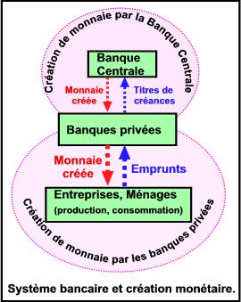
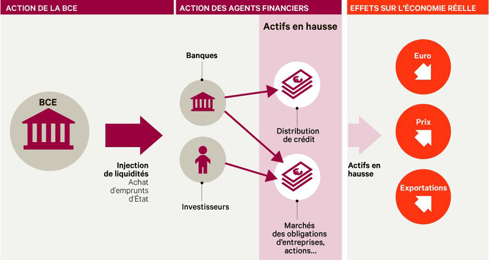
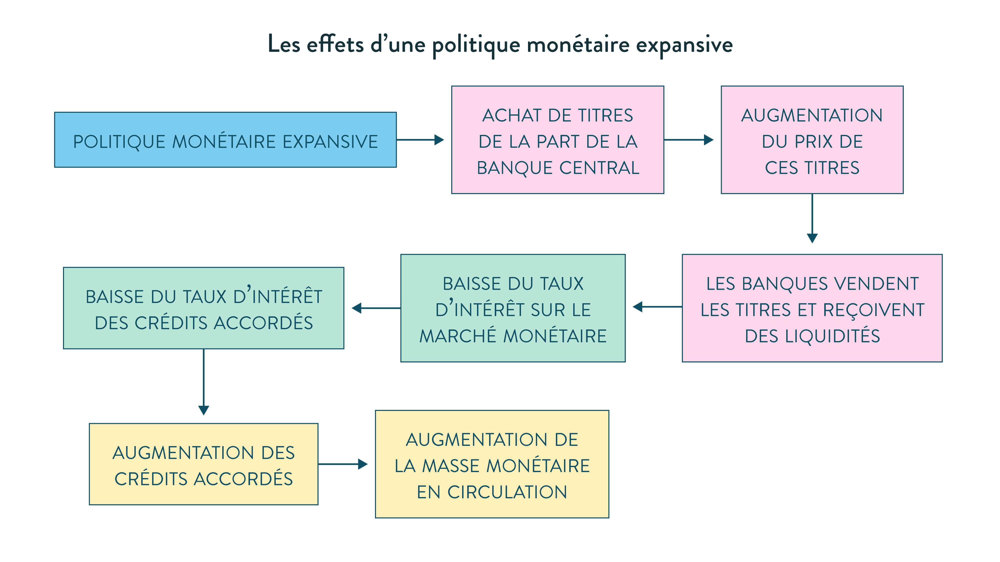
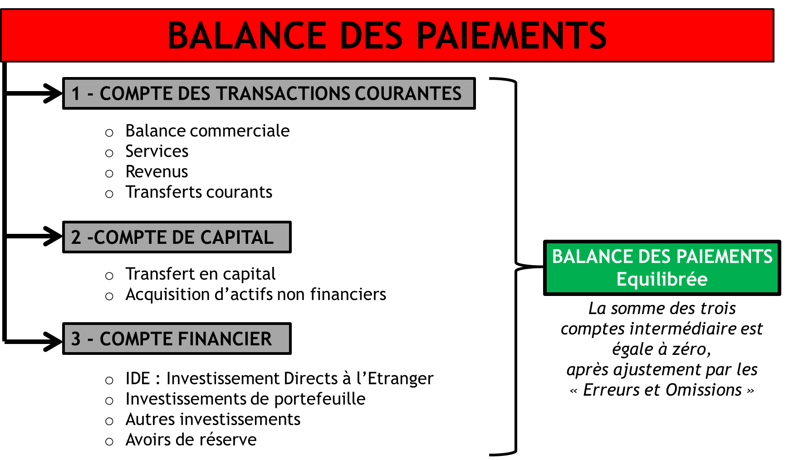

troc(以物易物)
交易成功的成本太高

monnaie
Trois qualités leur sont créditées pour assurer la fonction de monnaie: 
* elles sont acceptées par tous
* elles facilitent les échanges
* elles sont non périssables

# A quoi sert la monnaie

## fonction économique 经济作用

elle remplit simultanément: 
* le fonction d’unité de compte

La monnaie joue le rôle d’unité de compte ou d’étalon de valeur en permettant d’exprimer la valeur de tous les biens et services dans une unité commune ( l’euro ou le dollar) 使所有的商品和服务的价值都可以用一个共同的单位来表示

Elle permet de ce fait la comparaison des valeurs des biens entre eux, et facilite ainsi le calcul économique en évitant les multiples prix relatifs qu’impliquent le troc.
因此，它允许商品的价值相互比较，从而避免了以物易物中的多种相对价格，促进了经济计算。

La monnaie permet une double coïncidence des besoins, en permettant l’échange des biens contre de la monnaie (vente) et l’échange de la monnaie contre des biens ( achat). 货币通过允许用货物换取货币（销售）和用货币换取货物（购买），实现了需求的双重重合。

* le fontion d’intermédiaire des échanges 

C’est un facilitateur des échanges et un facteur de leur développement. Dans une économie caractérisée par des activités très diversifiées, la monnaie se révèle indispensable car elle favorise la spécialisation des agents économiques et l’augmentation de leur efficacité productive. Ces différents éléments mettent en lumière le rôle d’intermédiaire des échanges de la monnaie.

它是贸易的促进者，也是贸易发展的一个因素。在一个以高度多样化活动为特征的经济中，货币被证明是不可或缺的，因为它促进了经济主体的专业化，提高了他们的生产效率。这些不同的因素突出了货币作为贸易中介的作用。

* le fonction de réserve de valeur

La monnaie joue enfin le rôle de réserve de valeur, car elle permet de conserver la valeur au cours du temps. C’est un instrument d’épargne, , elle permet de différer la consommation, de faire face à des dépenses imprévues. C’est un actif sans risque ( pas de risque d’insolvabilité, ni d’illiquidité), un actif patrimonial parfaitement liquide. 

货币扮演着价值储存的角色，因为它使价值能够长期保留。它是一种储蓄工具，允许推迟消费和满足不可预见的费用。它是一种无风险的资产（没有破产或不流动的风险），是一种完全流动的世袭资产。

La fonction de réserve de valeur est remise en cause en période d’inflation. Elle devient un étalon instable. Il en résulte des comportements de fuite devant la monnaie ( l’hyperinflation allemande en 1922-1923 causée par le recours de la planche à billets pour financer les dommages de guerre de la Grande Guerre )

在通货膨胀时期，价值储备功能会受到质疑。它成为一个不稳定的标准。其结果是逃离货币（1922-1923年德国的恶性通货膨胀是由于使用印钞机为大战的战争损失提供资金而引起的）。

## fonction sociales

社区归属感。。。。。

* La monnaie facteur de pacification, évite la violence lors des échanges

* Pour Le sociologue allemand Georg Simmel, la monnaie est un instrument au service de l’émancipation des individus

* La monnaie facteur de puissance ou de pouvoir dans la société

* Pour les marxistes, la monnaie doit être analysée comme un rapport social. Elle déguise en réalité un rapport social d’exploitation entre les capitalistes et les travailleurs. La monnaie permet en effet aux bourgeois d’extorquer la plus value générée par la classe ouvrièr

对于马克思主义者来说，必须把货币作为一种社会关系来分析。它在现实中掩盖了资本家和工人之间的社会剥削关系。货币使资产阶级能够敲诈工人阶级产生的剩余价值。

## fonctions politiques

La monnaie en tant enjeu de pouvoir joue un rôle politique de premier plan.
Son rôle est de fédérer les citoyens autour de valeurs communes proclamées. 

作为一个权力问题，金钱起着关键的政治作用。
它的作用是将公民团结在宣称的共同价值观周围。

La monnaie véhicule un sentiment identitaire. Les billets portent souvent les traces d’une histoire ou d’une culture partagée au coeur d’une nation.

货币传达了一种身份感。纸币往往带有一个国家核心的共同历史或文化的痕迹。

La monnaie est garantie par une autorité politique, instaurée par la confiance en la société et ses institutions

货币由一个政治权威保证，通过对社会及其机构的信任而建立。

C’est un instrument au service du pouvoir politique via le monopole de l’émission et de la gestion de la monnaie légale. Elle sert au financement des dépenses publiques et régule l’activité économique.

它是一种通过垄断法定货币的发行和管理为政治权力服务的工具。它的作用是为公共开支提供资金并调节经济活动。

C’est aussi un instrument de puissance et de domination au service des Etats. Le rôle joué par le dollar depuis la fin de la Seconde Guerre mondiale en atteste «  le dollar c’est notre monnaie mais votre problème » avait affirmé un secrétaire d’état américain dans les années 70、、

它也是为国家服务的权力和统治的工具。自第二次世界大战结束以来，美元所扮演的角色证明了这一点："美元是我们的货币，但却是你们的问题"，一位美国国务卿在20世纪70年代如是说；

# La Création monétaire

## LA CREATION MONETAIRE PAR LES BANQUES DE SECOND RANG: CADRE D’ANALYSE ET MODELE MULTIPLICATEUR(二级银行的货币创造)

Il y a création monétaire lorsque les moyens de paiement en circulation dans l’économie augmente, d’autres termes lorsque la masse monétaire s’accroît.

### les principaux agents impliqués dans la création monétaire:

* Les agents privés ( ménages, SNF) participent à ce processus via la demande de crédits 私人代理人通过信用贷款参与这一过程

* Les banques commerciales de second rang via leur politique en matière d’octroi de crédits 二级商业银行通过其贷款政策参与这一过程

* Les banques centrales ou de premier rang dont la vocation est d’être la banque des banques. 中央银行或一级银行

### Les crédits font les dépôts, principal central à l’origine de la création monétaire(贷款方进行存款):

* Les banques créent de la monnaie à partir de rien, un simple jeu d’écriture suffit. 银行凭空创造货币,这是一种凭空创造货币的行为，不需要任何资源就可以授予信贷，银行发放信贷来自于相信这个词，因为债务人，有一个还款承诺

* L’octroi de crédits a des implications sur les bilans des acteurs impliqués. 贷款的发放对资产负债表有影响

###  Le crédit, la source principale de création monétaire

Chaque  crédit octroyé par la banque se traduit par une augmentation de la quantité de monnaie en circulation.

银行发放的每一笔贷款都会导致流通中的货币数量增加

### Les autres sources de création monétaire

* Il y a aussi création monétaire dès lors qu’une banque commerciale achète un actif qui n’est pas de la monnaie ( immeubles, actions,..) et qu’elle crée de la monnaie nécessaire au règlement de cette transaction. 
当商业银行购买不是货币的资产（房地产、股票等）并创造出结算交易所需的货币时，货币也会被创造出来。

* Lorsqu’une banque monétise un actif  non monétaire ( opération d’escompte d’une lettre de change)
当银行将非货币资产货币化（贴现汇票）时

* Lorsque les banques acquièrent des titres publics
当银行收购政府证券时

## La création monétaire

### La création monétaire par les banques de second rang: cadre d'analyse et modèle multiplicateur

货币供应量(la masse monétaire)增加的时候，就会产生货币

les principaux agents impliqués dans la création monétaire：
* Les agents privés ( ménages, SNF) participent à ce processus via la demande de crédits（家庭、公司SNF）
* Les banques commerciales de second rang via leur politique en matière d’octroi de crédits（商业银行）
* Les banques centrales ou de premier rang dont la vocation est d’être la banque des banques.（央行）

### Les crédits font les dépôts, principE central à l’origine de la création monétaire 贷款产生存款，货币创造的核心原则

* Les banques créent de la monnaie à partir de rien, un simple jeu d’écriture suffit. 银行凭空创造货币，只需要把它写下来
* Il s’agit d’une création monétaire ex nihilo: aucune ressource n’est nécessaire pour accorder un crédit. 钱是凭空创造的，发放贷款不需要任何资源
* L’octroi d’un crédit par la banque vient du mot « croire car il y a une promesse de remboursement de la part du débiteur, celui qui demande crédit. 银行因为相信经济主体会还款所以发放信贷，贷款人有一个偿还的承诺
* La création monétaire est une réponse à la demande de crédits de la part des agents économiques. 货币创造是对经济主体的信贷需求的回应
* L’octroi de crédits a des implications sur les bilans des acteurs impliqués. 信贷的发放对相关参与者的资产欠债表有影响

###  création monétaire dans le cas d’une banque unique

L’entreprise Soft est à court de trésorerie, elle sollicite un crédit à sa banque, le LCL , d’un montant de 100.000 euros. Soft公司缺钱，就向LCL银行申请课100000euros

Cette demande de crédit va induire des modifications au niveau du bilan de la banque LCL et de son client, l’entreprise Soft. 资产负债表发生变化

    Bilan LCL
    Actif            Passif
    Credit:100000    DAV:100000
    Total:100000     Total:100000

    Bilan Soft
    Actif            Passif
    Avoirs:100000    Dette:100000
    Total:100000     Total:100000

### Le crédit, la source principale de création monétaire

L'actif et le passif des deux acteurs augmentent simultanément(资产和负债同时增加)LCL是soft的债权人，soft是债务人

Chaque  crédit octroyé par la banque se traduit par une augmentation de la quantité de monnaie en circulation. En effet, les crédits accordés se transforment en dépôts sur les comptes clients en vertu de la logique selon laquelle « les crédits font les dépôts ». 银行发放的每笔贷款都会导致流通中的货币数量增加。因为所发放的贷款被转化为客户账户上的存款

Le crédit constitue ainsi la principale source de création monétaire scripturale. 信贷是货币创造的主要来源

### Les autres sources de création monétaire

* Il y a aussi création monétaire dès lors qu’une banque commerciale achète un actif qui n’est pas de la monnaie ( immeubles, actions,..) et qu’elle crée de la monnaie nécessaire au règlement de cette transaction. 当商业银行购买不是货币的资产（房地产、股票等），并创造出结算交易所需的货币时，也会创造货币。

* Lorsqu’une banque monétise un actif  non monétaire ( opération d’escompte d’une lettre de change) 银行将非货币资产货币化（将lettre de change贴现）

#### Lettre de change

汇票是一种金融工具，用于支付货款或作为债务的担保。它是由一方（出票人）发行给另一方（收款人）的一种书面承诺，承诺在特定日期或在要求时支付一定金额的货款。

商人和客户签署了一份5000欧的汇票，要求客户在三个月后支付其购买的商品的5000欧，一个月后商人面临现金流的问题，要求银行为其汇票贴现，银行就将汇票货币化，将资金预付给商人，但需要按taux d'escompte（贴现率）向商人收取一定费用

### Les autres sources de création monetaire

* Lorsque les banques acquièrent des titres publics. Il s’agit des concours apportés par les banques aux administrations publiques ( crédits contractés ou émission de titres de créance ( bons du Trésor pour financer la dette))

银行持有国债

Lorsque les banques détiennent des créances sur l’extérieur, cette situation se produit en deux circonstances, d’une part , lorsque les agents non résidents échangent des devises contre de la monnaie nationale à l’occasion par exemple d’une opération d’exportations de biens ou de services, d’autre part, lorsque les banques commerciales achètent des titres qu’émettent des agents non- résidents. 

银行持有外债，发生在两种情况下，非居民代理人将外币兑换成本国货币，例如在出口货物或服务时；当商业银行购买非居民代理人发行的债券时

### Création monétaire dans le cas d’un système bancaire diversifié

假设soft在获得贷款后从alpha公司购买了价值60000欧元的货物。alpha公司在SG有一个账户

    Bilan LCL
    Actif                                Passif
    Crédit à l'entreprise Soft:100000    DAV Soft:40000
                                         Dette envers SG:60000
    Total:100000                         Total:100000

    Bilan SG
    Actif                                Passif
    Créance sur la banque LCL:600000     DAV Alpha:60000
    Total:60000                          Total:60000

### Le processus de compensation interbancaire

Le paiement de l’entreprise Soft à l’entreprise Alpha a pour conséquence le transfert de 60000 euros de la banque LCL vers la banque SG. 
La banque LCL se retrouve débitrice de 60000 euros à l’égard de la banque SG. Elle doit s’acquitter de cette dette dans le cadre des opérations de compensation interbancaire lesquelles implique une intervention de la banque centrale.
Ce règlement s’effectue en monnaie centrale. Ce processus est facilité par le fait que les banques commerciales possèdent un compte auprès de la banque centrale.
Ce compte apparaît à l’actif des banques de second rang.

Soft公司向Alpha公司的付款导致60,000欧元从LCL公司转移到SG公司。
LCL银行欠SG银行60,000欧元。它必须通过涉及中央银行干预的银行间清算交易来结算这笔债务。
结算是以中央货币进行的。由于商业银行在中央银行有一个账户，这一过程得到了便利。
这个账户出现在二级银行资产负债表的资产一侧。

### Le règlement interbancaire implique la banque centrale

    Bilan LCL
    Actif                                Passif
    Crédit à l'entreprise Soft:100000    DAV Soft:40000
    Compte à la banque centrale:-60000                                   
    Total:40000                          Total:40000

    Bilan SG
    Actif                                Passif
    Compte à la banque centrale:+600000  DAV Alpha:+60000
    Total:60000                          Total:60000

### le rôle de la banque centrale dans la création monétaire

中央银行时银行的银行，商业银行被置于中央银行的监管之下

Elle incarne l’autorité monétaire par excellence en assurant de multiples fonctions:

* elle a le monopole de l’émission des billets et des pièces. C’est le  Trésor ( l’Etat) qui en France assure la fabrication des pièces, celles-ci sont ensuite vendues à la banque centrale qui se charge de les faire circuler.

它对纸币和硬币的发行拥有垄断权，财政部制造硬币和纸币，卖给中央银行，由其负责流通

* La banque centrale gère les réserves de change管理外汇储备
* Elle joue le rôle de prêteur en dernier ressort notamment en période de crise systémique 充当最后的贷款人，特别是在系统性危机的时候
* Elle intervient sur le marché monétaire en apportant de la liquidité ( opération d’open market) ( voir schéma) 提供流动性来干预货币市场
* Elle s’occupe de la gestion des comptes courants des banques de second rang domiciliés en son sein . 管理商业银行在央行注册的账户

---
    Bilan de la banque centrale

    Actif                                           Passif
    Devise et or(货币和黄金)                          Billets en circulation（流通中的货币）
    Créances sur le système bancaire(银行的债券)      Réserves obligatoires(储备金)
    Titres publics(公共证券)                          Réserves excédentaires(盈余储备金)

### La monnaie banque centrale

Le passif de la banque centrale est constitué de la monnaie centrale ou monnaie banque centrale. Elle comprend les billets ou la monnaie fiduciaire en circulation ainsi que les réserves obligatoires.

中央银行的负债由中央货币或中央银行货币组成。它包括流通中的钞票或货币以及储备金要求。

L’actif de la banque centrale constitué par l’ensemble de ses avoirs décrit les modalités de la création monétaire par la banque centrale.

中央银行的资产由其持有的所有资产组成，描述了中央银行如何创造货币。

La monnaie créée par la banque centrale est la seule acceptée pour les règlements interbancaires

中央银行创造的货币是银行间结算所接受的唯一货币。

### Les intruments de la banque centrale pour influencer la création monetaire 

La banque centrale peut influencer l’ampleur de la création en mobilisant différents  instruments:

Il y a d’abord, le taux directeur ou taux de refinancement : il s’agit du taux d’intérêt fixé par une banque centrale pour les prêts accordés (en liquidité) aux banques de second rang en besoin de liquidités en échange de titres mis en garantie ( actions, obligations) . Ce taux est central dans la conduite de la politique monétaire. Il est le baromètre du crédit. Son relèvement dissuade le crédit tandis sa diminution le stimule.

首先是基准利率或再融资利率：这是由中央银行设定的利率，用于向二级银行提供流动性贷款，以交换抵押的证券（如股票、债券）。这个利率在货币政策的执行中非常重要，它是信贷的晴雨表。如果该利率上调，会抑制信贷活动，而下调则会刺激信贷。

Il y a ensuite  le taux de dépôt, il correspond aux intérêts appliqués à la somme placée et reversée aux banques commerciales.

其次是存款利率，它是应用于存款并支付给商业银行的利息。

Le taux de prêt marginal s’applique quand une banque a besoin de liquidités. Ces prêts sont quotidiens et doivent être remboursés le jour suivant, contrairement aux taux de refinancement qui est hebdomadaire.

边际贷款利率适用于银行需要流动性的情况。这些贷款是按日计息的，必须在次日偿还，与再融资利率不同，再融资利率是按周计息。

Le taux de facilité de prêt marginal s’applique donc dans le cadre des liquidités que la banque centrale apporte au jour le jour ( soit 24 heures) aux banques commerciales en échange de titres.

边际贷款利率适用于中央银行提供给商业银行的每日流动性，交换条件是商业银行提供抵押品。商业银行可以在银行间市场（即隔夜资金市场）上向其他二级银行融资。当日的利率水平在很大程度上受到中央银行基准利率的影响。

Les banques commerciales peuvent se financer auprès d’autres banques de second rang sur le marché interbancaire ( marché de l’argent au jour le jour). Le taux d’intérêt en vigueur sur ce jour est largement influencé par le taux directeur de la banque centrale.

商业银行在进行日常经营活动时需要保持一定比例的准备金存款，这是根据中央银行规定的比例计算的。这意味着商业银行只能使用剩余的存款进行贷款和投资活动，而非全部存款。中央银行可以通过调整强制准备金率来控制商业银行的可贷资金量，从而对货币供应产生影响。

En plus du taux directeur, la banque centrale dispose d’un second instrument permettant de contrôler la création monétaire, il s’agit des réserves obligatoires ( vu précédemment)

强制准备金和边际贷款利率是中央银行运用的两种主要工具，用于管理银行体系中的流动性和货币供应。通过调整这些工具，中央银行可以影响银行体系的借贷活动、市场流动性以及整体经济的运行。需要注意的是，不同国家和地区的中央银行可能会有不同的政策和工具来管理货币供应和市场流动性，以适应本国的经济和金融体系。

### Les RO limitent la capacité des banques à créer de la monnaie

Il en découle le fait que plus le taux de RO est élevé, plus la capacité des banques à accorder de nouveaux crédits est faible ( inversement).

Lors de crises économiques ou de morosité économique, les banques centrales procèdent généralement à une baisse des taux directeurs et du taux de RO afin d’inciter les banques à créer davantage de monnaie pour les besoins de relance économique.

### Les limites à la création monétaire

Le pouvoir de création monétaire est limité et encadré.

Il est limité du fait des retraits des billets effectués par les clients sur leurs dépôts; les banques doivent se les procurer sur le marché monétaire moyennant un taux d’intérêt ou les retirer sur leurs dépôts auprès de la banque centrale.

La seconde limite découle des contraintes imposées par les RO, constitués de dépôts non rémunérés auprès de la banque centrale. 

### La destruction monétaire et la création nette de monnaie

la destruction monétaire accompagne la création monétaire : A toute opération de création monétaire est associée une opération de destruction monétaire. Celle-ci intervient lorsque:

货币毁灭伴随着货币创造：每个货币创造操作都与货币毁灭操作有关。这发生在以下情况：

Le débiteur rembourse le crédit initialement octroyé par la banque

Il y a une opération d’importation: l’importateur est généralement tenu de payer son fournisseur en devises. Il est ainsi conduit à convertir une certaine quantité de monnaie nationale en devises ( des euros contre des dollars par exemple). Cette opération de conversion se traduit par une diminution des euros en circulation.

有一笔进口交易：进口商一般有义务用外币向其供应商付款。因此，进口商必须将一定数量的本国货币转换成外币（例如，欧元转换成美元）。这种转换操作会导致流通中的欧元数量减少。

### La création nette de monnaie dépend de la conjoncture économique

Au final la création nette de monnaie est la différence entre la création monétaire et la destruction monétaire.

Elle est tributaire de la conjoncture économique. La création nette de monnaie est plus élevée en période de croissance économique. Les anticipations positives des agents économiques favorisent la demande de crédits à des fins de consommation et d’investissement. 

A l’inverse, lorsque la conjoncture est morose , la création nette de monnaie est plus faible.

最后，净货币创造是货币创造和货币毁灭之间的区别。
它取决于经济环境。在经济增长的时期，净货币创造量较高。经济主体的积极预期鼓励了对消费和投资目的的信贷需求。
相反，当经济不景气时，净货币创造就会降低。

### les agrégats monétaires et les contreparties de la masse monetaire

les agrégats monétaires, un instrument de mesure de la masse monétaire: Mesurer la quantité de monnaie en circulation dans l’économie est d’un intérêt crucial. 

货币总量，衡量货币供应量的工具

Les agrégats permettent de mesurer la quantité de monnaie en circulation mais aussi de classer les formes de monnaie selon un degré de liquidité.
Dans le cadre de la zone euro, trois agrégats monétaires ont été définis: M1, M2, M3

总量使得衡量流通中的货币数量成为可能，同时也可以根据货币的流动性程度对其进行分类。
欧元区已经定义了三种货币总量：M1、M2、M3。

L’agrégat monétaire M1 mesure la monnaie au sens strict. Il inclut les billets et les pièces, les dépôts à vue ( des ménages, des entreprises, des administrations publiques,..). Il s’agit en somme de l’ensemble des moyens de paiement utilisés par les agents économiques.

L’agrégat monétaire M2 inclut M1et les dépôts considérés comme de la quasi-monnaie, il regroupe tous les actifs financiers qui peuvent être transformés en moyen de paiement immédiat . Il s’agit des dépôts à terme inférieurs à deux ans ( les comptes à terme par exemple), des dépôts avec préavis inférieurs à trois mois, ce sont des placements non risqués et disponibles à vue ou immédiatement ( livret A, livre de développement durable, livret d’épargne….)

M1（狭义货币）：M1是最窄的货币总量指标，主要衡量货币的狭义定义。它包括以下部分：

* 纸币和硬币：流通中的现金货币。
* 即期存款：包括家庭、企业、政府等机构的即时可用存款。它们是经济主体日常交易和支付所使用的货币。

M2（准货币）：M2是较宽的货币总量指标，除了包括M1的内容外，还包括被视为准货币的存款。具体包括：

* M1：即M1的定义，包括现金货币和即期存款。
* 期限在两年以下的定期存款：指存款在规定期限内无法提前支取的存款，例如定期存款账户。
* 通知期限在三个月以下的存款：指可以在规定的通知期限内支取的存款，如法定通知存款。
* 其他类似的流动性较高、较低风险的储蓄和投资工具，如法定储蓄（livret A）、可持续发展储蓄（livret de développement durable）、储蓄存款账户等。

M3（广义货币）：M3是最宽的货币总量指标，涵盖了M2的范围，并且还包括了较不易流通的货币部分。具体包括：

* M2：即M2的定义，包括M1、定期存款和通知存款。
* 向央行质押的养老金或债券：指向央行交换现金的抵押品，例如养老金资产或债券。
* 期限在两年以下的债券和证券：指期限在两年以内的债券和金融证券。
* 其他类似的较长期限、较不易流通的金融工具，如开放式投资基金的股票等。

M1, M2, M3 , constituent la masse monétaire, elle indique l’ensemble des moyens de paiement dont disposent les agents économiques pour effectuer des transactions de le cadre des échanges marchands.

M1、M2和M3构成了货币供应量，它表明经济主体在贸易中进行交易的所有支付手段。

Le contrôle de la masse monétaire revêt une importance cruciale car il permet aux autorités monétaires de mieux cibler la politique monétaire.

控制货币供应量是至关重要的，因为它使货币当局能够更好地确定货币政策。

Les autorités monétaires peuvent augmenter ou diminuer la masse monétaire en agissant sur la base monétaire appelée parfois M0. Celle-ci désigne la monnaie créée par une banque centrale qu’on appelle également monnaie centrale ( billets pièces, RO) 

货币当局可以通过作用于货币基础（有时称为M0）来增加或减少货币供应。这指的是中央银行创造的货币，也被称为货币基础（纸币、硬币、RO）。

### Les contreparties de la masse monétaire

La masse monétaire correspond à des engagements des institutions monétaires financières auprès des agents économiques non financiers. Ces engagements figurent ainsi au passif de ces agents. Ils sont associés à des contreparties qui , elles, figurent à l’actif des institutions monétaires et financières. Ces contreparties sont les sources de la création monétaire. 

On distingue ainsi trois contreparties de la masse monétaire : les avoirs extérieurs nets, les créances nettes sur l'Etat et les crédits à l'économie. 

Les créances nettes sur l'extérieur : Les entrées de devises étrangères au sein d'un pays augmentent la masse monétaire. On prend alors en compte l'ensemble des devises détenues par les instituions financières. L'or est également une contrepartie.

Le crédit interne net : Ce sont les créances sur le trésor public détenues par la banque centrale. L'Etat peut décider d'émettre de nouveaux billets ou pièces de monnaies. Dans ce cas, la banque centrale fait tourner la planche à billets et en contrepartie, elle dispose d'une créance sur le trésor public. Ces créances sont une contrepartie mineure dans la création monétaire. De plus, le trésor public n'est pas à l'origine des décisions de l'augmentation de la masse monétaire. C'est la banque centrale qui décide de la politique monétaire à adopter en fonction du niveau des différents agrégats monétaires souhaité.

Les créances sur l'économie : Ce sont l'ensemble des crédits accordés aux agents économiques par les banques .  En effet faire crédit , c'est accorder un pouvoir d'achat qui à la base n'existait pas.

### Le mutiplicateur et le diviseur de crédit

le mécanisme du multiplicateur: Il a pour intérêt d’expliquer la capacité du système bancaire à augmenter de manière plus que proportionnelle la quantité de monnaie créée. Il met en lumière la relation entre la monnaie centrale et la monnaie créée par les banques de second rang.

乘数机制：这解释了银行系统超过比例地增加货币创造量的能力。它强调了货币基础和二级银行所创造的货币之间的关系。

Pour expliquer le mécanisme, il faut partir d’un certain nombre de données. Supposons qu’un client de la banque LCL demande crédit de 1000 euros et obtient l’accord de la dite banque.  Ces 1000 € de crédit se transforment en 1000 € de dépôt. Supposons que le taux de RO ( réserves obligatoires) encore appelé coefficient de réserve est de 10%. La banque doit alors alimenter son compte à la banque centrale pour un montant de 100€.  La banque  dispose  donc de 900 € de réserves excédentaires, elle va pouvoir les utiliser pour octroyer de nouveaux prêts.

为了解释这个机制，我们需要从一定量的数据开始。假设LCL银行的一个客户要求1000欧元的信贷，并获得了上述银行的同意。 这笔1000欧元的贷款被转换为1000欧元的存款。我们假设RO（准备金要求）比率，也被称为准备金率，是10%。然后，该银行必须在其在中央银行的账户中存入100欧元。 因此，银行有900欧元的超额准备金，它可以用来发放新贷款。

Ces 900€ de crédit créent 900 € de dépôt dans une banque B . Tout comme la précédente, la banque B doit alimenter son compte à la banque centrale de 90 euros, et le reste c’est-à-dire 810€ vont servir de réserves excédentaires. Celles-ci n’étant pas rémunérées par la banque centrale serviront à la banque B pour accorder de nouveaux prêts.

这900欧元的贷款在B银行创造了900欧元的存款。就像前一家银行一样，B银行必须在其在中央银行的账户中增加90欧元，其余的，即810欧元，将被用作超额储备。由于这些储备金没有得到中央银行的报酬，它们可以被B银行用来发放新贷款。

Ces 810 € de crédits vont se traduire en dépôts au profit d’une banque C. Celle-ci va devoir constituer des RO d’une valeur de 81€, il lui restera alors des réserves excédentaires de 729 € qui servent à accorder de nouveaux prêts…

这些810欧元的贷款将转化为有利于C银行的存款。这家银行将不得不建立价值81欧元的投资回报率，留下729欧元的剩余储备，它可以用来发放新的贷款......

Le processus de création monétaire se poursuit et se reproduit de manière identique infiniment.
La quantité de monnaie créée au final peut-être évaluée. 

货币创造过程继续进行，并以同样的方式无限复制。
最终创造的货币数量可以被计算出来。

        En constatant que 900 = 1000 ( 1- 10%), que 810 = 1000 ( 1-10%)(1-10%), que 
        729 = 1000 ( 1-10%)(1-10%)(1-10%)
        La somme précédente peut s’écrire de la manière suivante:
        1000 + 1000(1-10%) +1000(1-10%)(1-10%)+1000(1-10%)(1-10%)(1-10%)+....
        Soit 1000 [ 1+(1-10%)+(1-10%)²+ (1-10%)³+……]
        = lim 1000( 1- (0.9))^n / (1- 0.9)
          n→∞
On est en présence d’une suite géométrique de premier terme 1000 et de raison 0.9
La lim de cette suite à l’infini est de 10000
Les 1000 € de dépôts initiaux ont ainsi permis au système bancaire de générer une création monétaire de 10000 €, soit une quantité de monnaie multipliée par 10.
En notant R le coefficient de réserves obligatoires, on peut déterminer l’expression du multiplicateur de crédit noté M
M= 1/R

Ce multiplicateur de crédit indique que chaque euro de dépôt peut générer 1/R euro de monnaie supplémentaire. 
Dans l’exemple précédent, le multiplicateur de crédit est égal à 1/0.1 = 10.

### Generalisation et modelisation du modele

    Soit A le dépôt initial et R le taux de RO, il est possible de calculer le supplément de monnaie créée, soit ∆M de la manière suivante:

    ∆M = A+ A ( 1-R)+ A(1-R)²+A(1-R)³+……….+ A(1-R)n
    ∆M est une suite géométrique dont la somme est égale à S = A[1−(1−R)n/1−(1−R)
    Lorsque n →∞, cette somme est égale à A/1−(1 −R) = A1/R = AM
    Avec M = 1/R = 1/1−(1−R)

### LE modele du multiplicateur de credit

Les banques sont confrontées à deux fuites: les réserves obligatoires et les retraits de billets. En tenant compte de cette réalité, supposons à présent que:
- la masse monétaire , notée M est composée des billets, notés B et des dépôts à vue notés D: On a ainsi M = B + D

货币供应量 现金+活期存款

La base monétaire , notée H, qui par définition correspond au passif de la banque centrale est composée des billets B et des réserves obligatoires notées RO. 
Dès lors H = B  + RO

货币基础 中央银行的负债,包含现金和存款准备金

货币发行（Currency in Circulation）：这是指由央行发行并流通于公众手中的纸币和硬币的总额。它代表了公众持有的现金，可以用于日常交易。

存款准备金（Reserves）：这是商业银行在央行保留的存款，以满足存款准备金要求。存款准备金是商业银行持有的现金储备，以应对客户提取现金或满足支付结算需求。

货币基础在货币供应链中起着关键的作用。它为商业银行创造货币提供了基础，因为商业银行可以利用存款准备金进行贷款和信用活动。货币基础的规模和增长对经济和货币政策具有重要影响。央行通过控制货币基础的供给来实施货币政策，以达到宏观经济管理的目标，例如控制通胀、促进经济增长等。

Les RO correspondent à une fraction r des dépôts, soit RO = rD

Les billets représentent une proportion b de la masse monétaire, soit : 
    
    B = Bm

现金代表货币供应量的一个比例b，即 ： B = Bm

Dès lors, les dépôts constituent le complément à la masse monétaire. 存款构成了货币供应量的其余部分。

Soit 
        
    D =(1- b) M

On peut reécrire la base monétaire comme:
    
    H = B+RO =bM +rD= bM +r(1-b)M = M[(b+r(1-b)]

La relation entre la masse monétaire et la base monétaire est ainsi établie:

    M = H/b+r ( 1−b) = mH 
    avec m = 1/b+r(1−b) le multiplicateur de crédit.

La précédente équation montre qu’il existe une relation entre la masse monétaire et la base monétaire. Le multiplicateur de crédit mesure ainsi le rapport entre la masse monétaire et la base monétaire. Cette relation est fonction des facteurs de la liquidité bancaire.

前面的方程式表明，货币供应量和货币基础之间存在着一种关系。因此，信贷乘数衡量的是货币供应量和货币基础之间的关系。这种关系是银行流动性因素的一个函数。

Le modèle du multiplicateur de crédit est critiqué car il ne s’agit que d’une source de création monétaire, l’octroi de crédit, or il existe diverses sources de création monétaire, qui ne sont pas prises en compte par le modèle. Il ne tient pas non plus compte des fuites d’autres formes de monnaie ou placements.

信贷乘数模型被批评为只关注货币创造的一个来源，即发放信贷，而有各种货币创造的来源没有被该模型考虑在内。它也没有考虑到其他形式的货币或投资的流失。

### Banking school versus currency school

La notion de multiplicateur ou de diviseur de crédit renvoie à la question du caractère exogène ou endogène de la monnaie.

信用乘数或除数的概念是指货币是外生的还是内生的问题。

Cette question a divisé les économistes au cours du 19 eme siècle avec d’un côté les partisans de la Banking School ( l’école de la banque)et de l’autre ceux de la Currency School ( l’école de la circulation).

这个问题在19世纪的经济学家中产生了分歧，银行学派是一方，货币学派是另一方。

Pour les partisans de la Currency School, l’offre de monnaie est une variable exogène du fait que la masse monétaire est déterminée par les réserves préalables détenues par les banques de second rang auprès de la banque centrale. C’est donc elle qui en dernier ressort contrôle la création monétaire.

在货币学派看来，货币供应量是一个外生变量，因为货币供应量是由二级银行在中央银行持有的储备金决定的。因此，最终控制货币创造的是中央银行。

Les partisans de la Banking School contestent cette vision qui occulte le rôle des banques de second rang dans le processus de  création monétaire. En effet, ce sont elles qui via le crédit alimente la masse monétaire en circulation. Elles ont donc un rôle actif. Ainsi la relation précédente mise en lumière par le multiplicateur de crédit s’inverse. En accordant des crédits, les banques se retrouvent en situation de besoin de financement qui les oblige à se tourner vers la banque centrale. Dans ce cas, c’est la base monétaire qui s’ajuste à la variation de la masse monétaire. 

银行学派的支持者对这种观点提出异议，因为它掩盖了二级银行在货币创造过程中的作用。事实上，正是他们通过信贷为流通中的货币供应量提供资金。因此，他们发挥着积极的作用。因此，以前由信贷乘数所强调的关系被颠覆了。通过发放信贷，银行发现自己处于需要融资的境地，这迫使他们转向中央银行。在这种情况下，是货币基础根据货币供应量的变化进行调整。

Il découle de ce qui précède le diviseur de crédit, noté d, qui établit une relation entre la masse monétaire et la base monétaire  : H = 1/mM=dM 

这就产生了信贷除数，用d表示，它在货币供应量和货币基础之间建立了一种关系：H=1/mM=dM 

La monnaie est alors considérée comme endogène puisque le refinancement demandé par les banques de second rang à la banque centrale est une fraction 1/m du crédit qu^′elles ont préalablement accordé. C’est donc la vision de la Banking School.

然后，货币被认为是内生的，因为二级银行向中央银行申请的再融资是它们先前发放的信贷的1/m的一部分。这就是银行学派的观点。

Mathématiquement, les notions de multiplicateur et de diviseur de crédit sont assez proches, l’un étant égale à l’inverse de l’autre, elles apparaissent néanmoins comme le reflet de deux conceptions opposées de la monnaie et de son processus de création. Elles impliquent aussi des conceptions différentes en matière de conduite de la politique monétaire.

在数学上，乘数和信贷除数的概念非常相似，一个等于另一个的倒数，但它们似乎反映了对货币及其创造过程的两种对立概念。它们也意味着对货币政策行为的不同概念。

货币的外生性观点是指货币供应是由中央银行通过直接控制决定的，它是一个外部决定因素。按照这种观点，中央银行通过调整货币基础（通常是通过调整存款准备金率或进行开放市场操作）来直接影响货币供应量。乘数的概念与外生性观点相关，它表示基础货币变动对整个货币供应量的乘数效应。例如，如果存款准备金率为10%，那么每增加1单位的基础货币，最终货币供应量可能会增加10单位。

然而，货币的内生性观点认为货币供应量是由商业银行的信贷活动和需求决定的。商业银行通过向借款人提供贷款和发行存款来创造货币。根据这种观点，商业银行的信贷活动驱动货币供应的增长。在这种情况下，商业银行通过贷款创造的存款数量超过了它们持有的储备金数量。这就是除数的概念，它表示每单位的储备金可以支持的货币供应量。

从数学上讲，乘数和除数是相互倒数的关系。如果乘数为m，则除数为1/m。它们反映了对货币的不同理解和货币创造过程的两种观点。这些观点也导致了在货币政策的实施上的不同看法。

## La Monnaie Dans la théorie économique

### la théorie quantitative de la monnaie (TQM): 

Elle trouve son origine sans la controverse qui oppose Jean Bodin à J Malestroit au 16 ème siècle. L’objet de la controverse porte sur l’origine de l’augmentation du coût de la vie.

Pour J Bodin, c’est l’accumulation des métaux précieux provenant des colonies qui en est la cause car elle a pour contrepartie une augmentation croissante de la quantité de monnaie en circulation supérieure à la production disponible. Ce que récuse J Malestroit.
1) l’approche par l’équation de Fischer : C’est Irving Fischer qui élabora le premier la TQM. Il part du constat suivant «  au cours d’une année, le total de la monnaie payée a une valeur totale égale à la valeur total des biens achetés »

Ce constat conduit à la formulation de l’équation des échanges suivantes:

MV = PT avec M désignant la masse monétaire, V, la vitesse de circulation de la monnaie, P le niveau général des prix, et T le volume total des transactions.

M: 代表货币量

V: 代表货币流通速度 indique le nombre de fois où la monnaie change de main au cours d’une période. Un billet de 10 euros par exemple n’est jamais utilisé pour une seule transaction. Il change plusieurs fois de main. 

P: 代表一般价格水平

T: 代表交易总数

MV représente la capacité totale d’achat de la monnaie 

PT représente la valeur totale des biens achetés

La vitesse de circulation dépend des comportements des agents économiques en matière de dépense et d’épargne mais également des habitudes de paiement et des innovations financières.

流通速度取决于经济主体的消费和储蓄行为，但也取决于支付习惯和金融创新。

Fischer pose trois hypothèses pour consolider son modèle d’équation: il suppose qu’à court terme , la vitesse de circulation de la monnaie est constante, l’économie est en situation de plein emploi, les transactions sont donc stables, l’évolution de la masse monétaire est placée sous l’égide des autorités monétaires qui peuvent l’accroître ou la baisser.

费舍尔做了三个假设来巩固他的模型方程：他假设，在短期内，货币速度是恒定的，经济处于充分就业状态，所以交易是稳定的，货币供应量的变化是在货币当局的主持下，他们可以增加或减少。

### Le lien monnaie - inflation

Ces hypothèses ont une implication majeure sur le lien entre masse monétaire et l’évolution du niveau général des prix

这些假设对货币供应量和一般价格水平的变化之间的联系有重大影响

Tout accroissement de la masse monétaire a une répercussion sur le niveau des prix, en d’autre terme l’inflation provient d’une croissance de la masse monétaire.

货币供应量的任何增加都会对价格水平产生连锁反应，换言之，通货膨胀来自货币供应量的增加。

En guise d’exemple, un doublement de la masse monétaire c’est à dire M débouche sur un doublement des prix compte tenu du fait que  V et T sont constants.

举例来说，在V和T不变的情况下，货币供应量增加一倍，即M，会导致价格增加一倍。

### l’approche par l’équation des encaisses de cambridge

Marshall et Pigou, deux économistes britanniques vont s’attacher à reformuler la TQM.

Cette reformulation est rendue nécessaire par le fait que la comptabilité nationale n’est pas en mesure d’évaluer chacune des transactions effectuées au sein d’une économie pendant une période. Elle le fait à partir des quantités agrégées.

由于国民经济核算无法评估一个经济体在一段时期内进行的每一项交易，因此有必要进行这一重新表述。它是在总量的基础上进行的。

Le volume des transactions est ainsi remplacée par la production ou le PIB

因此，交易量被产出或GDP所取代。

L’équation de la TQM devient: 

    MV = PY

Avec Y désignant le PIB réel, PY le PIB nominal, V vitesse de circulation de la monnaie

其中Y是实际GDP，PY是名义GDP，V是货币流通速度。

V est aussi appelé vitesse revenu, il traduit le nombre de fois que la monnaie doit circuler afin d’acheter la production.

V也被称为收入速度，它反映了为了购买产出，货币必须流通的次数。

De l’équation de la TQM, on peut établir une demande de monnaie pour motif de transaction: Md = PY/V ou Md/P = Y/V ou Md/ P = k Y avec k = 1/V

从TQM方程中，我们可以建立一个用于交易目的的货币需求：Md=PY/V或Md/P=Y/V或Md/P=k Y，其中k=1/V。

Cette équation est appelée équation des encaisses de Cambridge. Elle correspond à la demande de monnaie pour le motif de transaction

这个方程被称为剑桥现金方程。它与交易目的的货币需求相对应。

La reformulation de la TQM débouche néanmoins sur la même conclusion: tout accroissement de la MM provoque une augmentation du niveau général des prix.

然而，对MQT的重新表述导致了同样的结论：M的任何增加都会导致一般价格水平的提高。

### l’approche keynésienne du rôle de la monnaie

1) une approche aux antipodes de la précédente: Pour les classique, la monnaie n’est qu’un voile, elle n’a pas d’effet sur les quantités réelles. Une position récusée par Keynes car pour lui, la monnaie est un actif en soi , elle peut de ce fait être demandée pour elle-même en raison de ce qu’il appelle la préférence pour la liquidité.

对于古典主义者来说，货币只是一个面纱，它对实际数量没有影响。凯恩斯拒绝了这一立场，认为货币本身就是一种资产，因此可以为其本身而需求，因为他称之为流动性偏好。

Keynes développe différents motifs de demande de la monnaie: le motif de transaction, le motif de précaution et le motif de spéculation.

凯恩斯为货币需求提出了不同的动机：交易动机、预防动机和投机动机。

Le motif de transaction: les agents économiques conservent de la monnaie pour compenser le décalage entre le moment où ils perçoivent un revenu et celui où ils réalisent une dépense ( consommation , investissement) et effectuent la transaction.

交易动机：经济主体持有货币是为了弥补他们在收到收入和进行支出（消费、投资）以及进行交易之间的时间差。

Le motif de précaution: les agents conservent des liquidités pour faire face à d’éventuelles difficultés financières futures. Keynes considère que plus les ménages peuvent se procurer facilement des liquidités, moins ce motif pèsera dans leur demande de monnaie.

预防性动机：代理人持有流动资产，以防他们在未来遇到财务困难。凯恩斯认为，家庭越容易获得流动资金，这种动机对他们的货币需求的影响就越小。

Le motif de spéculation: il s’agit pour les ménages de la possibilité d’utiliser leurs liquidités à des fins de spéculation.

投机动机：对家庭来说，这是将其流动性用于投机目的的可能性。

### Le revenu et le taux d’intérêt, deux déterminants de la demande de monnaie

Keynes met en avant le revenu et le niveau du taux d’intérêt pour expliquer les différents motifs de demande de monnaie.

凯恩斯提出了收入和利率水平来解释货币需求的不同动机。

Le motif de transaction apparaît comme une fonction croissante du revenu des individus. Plus les individus disposent de revenus élevés, plus ils sont disposés à consacrer une part croissante de leurs revenus pour leurs transactions.

交易动机似乎是个人收入的一个增加函数。人们的收入越高，他们就越愿意把越来越多的收入比例用于交易。

le motif de précaution est lui aussi fonction du revenu. Plus leur niveau est élevé, plus les individus peuvent se prémunir en cas de dépense imprévue. 

预防性动机也是收入的一个函数。他们的水平越高，个人就越能保护自己免受不可预见的支出。

Le motif de spéculation est lié au taux d’intérêt;  Il existe selon Keynes, une relation inverse entre le taux d’intérêt et la demande de monnaie de spéculation. 

根据凯恩斯的观点，利率和投机性货币的需求之间存在着反比关系。

La demande de monnaie de spéculation s’accroît au fur et à mesure que les taux d’intérêt diminue.

当利率下降时，对投机性货币的需求就会增加。

### la trappe à liquidité

La trappe à liquidité, ou piège à liquidité (de l'anglais liquidity trap), est un phénomène économique mis en lumière par Keynes, il se traduit par le fait que  « une fois que le taux d'intérêt a chuté en dessous d'un certain niveau, la préférence pour la liquidité est telle qu'elle devient absolue, dans le sens où presque tout le monde préfère conserver de la monnaie plutôt que de détenir de la dette, du fait du taux d'intérêt si bas »

Ce phénomène s’explique de la manière suivante : lorsque les rendements attendus des investissements en valeurs mobilières ou en biens immobiliers et équipements sont faibles, les investissements chutent, une récession commence et les avoirs en espèces des banques augmentent. Les particuliers et les entreprises continuent alors de détenir des liquidités parce qu'ils s'attendent à ce que les dépenses et les investissements soient faibles, créant ainsi un piège auto-réalisateur. C'est le résultat de ces comportements (individus thésaurisant des liquidités en prévision d'un événement économique négatif) qui rend la politique monétaire inefficace et crée ce que l'on appelle la trappe à liquidité.

流动性陷阱（Liquidity Trap）是宏观经济学中的一个概念，用于描述一种经济情况，其中货币政策失效，无法刺激经济增长和通货膨胀。

在流动性陷阱中，通常发生以下情况：央行通过降低利率来增加货币供应，以刺激经济活动和投资。然而，当经济面临严重的不确定性和悲观预期时，企业和个人可能会持有大量的现金，而不是将其用于投资或支出。这种情况下，降低利率并不能鼓励更多的投资和支出，因为人们更倾向于将资金保留为现金。

在流动性陷阱中，利率已经降至接近零的水平，但经济仍然处于低迷状态。央行的货币政策工具失去了对经济的影响力，因为货币供应增加已无法刺激企业和个人增加支出和投资。此时，经济可能面临通货紧缩风险，因为价格下降和需求疲软。

流动性陷阱的一个关键原因是人们的预期。当人们对经济的未来持悲观态度时，他们更倾向于保留现金，而不是进行支出或投资。这种预期可以形成一种恶性循环，使得降低利率对经济刺激的效果减弱。

应对流动性陷阱的挑战是困扰央行和政策制定者的重要问题。在这种情况下，政府可能需要采取其他货币政策工具或财政政策措施来刺激经济，如增加政府支出或减税，以提高需求并重启经济增长。

## la politique monétaire

La politique monétaire est un instrument de politique économique, elle consiste pour les autorités monétaire à agir sur les conditions de financement de l’économie dans le but  d’influencer l’état de la conjoncture économique, d’améliorer l’état de l’emploi  et de garantir la stabilité des prix.

货币政策是经济政策的一个工具。 对于货币当局来说，它包括对经济的融资条件采取行动，目的是影响经济形势，改善就业和保证价格稳定。

Elle relève des politiques conjoncturelles et ce sont les banques centrales qui ont vocation de la mettre en œuvre , la BCE dans le cadre de la zone euro et la FED aux USA.

它是经济政策的一部分，由中央银行、欧元区的欧洲央行和美国的联邦储备银行实施。

### les objectifs et les instruments de la politique monétaire

Plusieurs objectifs sont poursuivis par la politique monétaire, la relance de l’activité économique ou la croissance économique, la stabilité des prix, la lutte contre le chômage ou l’équilibre extérieur. Ses  objectifs sont ceux du carré magique mais ils peuvent évoluer selon les périodes.

货币政策追求一些目标：刺激经济活动或经济增长，价格稳定，消除失业或维持外部平衡。这些目标是魔方的目标，但它们可能在不同时期发生变化。

1) la stabilité des prix est devenue une priorité à partir des années 80
Les années 70 sont marquées par l’émergence d’un phénomène appelé Stagflation c’est-à-dire la conjugaison d’un chômage de masse avec une inflation élevée

1）价格稳定在80年代成为一个优先事项
20世纪70年代，出现了一种被称为滞胀的现象，即大规模失业和高通货膨胀的结合。

La courbe de Philipps, c’est-à-dire l’arbitrage inflation chômage ne se vérifie plus. Les monétaristes remettent en scelle la TQM via les travaux de l’économiste américain Milton Friedman. Ils affirment que la lutte contre l’inflation implique un contrôle strict de la création monétaire.

菲利普斯曲线，即通货膨胀与失业的权衡，不再有效了。货币主义者通过美国经济学家米尔顿-弗里德曼（Milton Friedman）的工作为TQM盖上了印章。他们认为，与通货膨胀作斗争需要严格控制货币创造。

Les politiques de désinflation compétitive menée en France notamment auront un principal objectif lutter contre l’inflation afin de restaurer la compétitivité-prix de l’économie française.

特别是在法国推行的竞争性去通货膨胀政策将有一个主要目标：打击通货膨胀，以恢复法国经济的价格竞争力。

La création de la BCE avec la venue de l’euro  consacre la stabilité des prix comme objectif principal de la banque européenne. Celle-ci est indépendante du pouvoir politique, elle n’a pas conformément au Traité de Maastricht d’injonctions à recevoir des autorités politiques. 

随着欧元的出现，欧洲央行的成立确立了价格稳定是欧洲银行的主要目标。欧洲央行独立于政治权力，根据《马斯特里赫特条约》，不接受政治当局的命令。

A la lutte contre l’inflation s’ajoute un nouvel objectif à l’actif des banques centrales à partir des années 90,  il s’agit d’assurer la stabilité du système financier dans un contexte marqué par la globalisation financière. Dans ce contexte, les banques centrales jouent le rôle de PDR ( Prêteur en Dernier ressort).

除了对抗通货膨胀，中央银行自20世纪90年代以来还有一个新的目标：在金融全球化的背景下，确保金融系统的稳定。在这种情况下，中央银行扮演着最后贷款人的角色。

### Les instruments de la politique monétaire

Pour contrôler la masse monétaire circulation, la banque centrale dispose d’instruments directs et indirects.

为了控制货币供应量，中央银行有直接和间接的工具可以使用

Les instruments directs visent à agir sur la quantité de monnaie créée tandis que les instruments indirects à influencer la liquidité bancaire.

直接手段旨在影响货币创造的数量，而间接手段旨在影响银行的流动性

L’encadrement du crédit relève des instruments directs. Il s’agit d’une mesure réglementaire et autoritaire qui s’impose aux banques qui doivent respecter un certain pourcentage d’augmentation annuelle des crédits qu’elles accordent à leurs clients.

直接手段包括信贷控制。这是对银行实施的监管和专制措施，银行必须遵守他们给予客户的信贷每年增加一定的百分比。

Cette mesure a été supprimée au milieu des années 80

Un exemple pour illustrer ce cas de figure. Si la banque centrale face à la menace inflationniste décide de resserrer le volume de crédits distribués en augmentant le niveau de son taux directeur. Celui passe de 0.5% à 1.5%, cela veut dire que le financement des banques commerciales subit un surcoût de 1point de %. Pour maintenir leur rentabilité, elles vont devoir proposer à leurs clients des crédits dont le taux d’intérêt sera au moins supérieur ou égal à 1.5%. Face à l’augmentation du loyer de l’argent, certains agents vont renoncer à s’endetter, le volume de crédits distribué va alors baisser ainsi que la masse monétaire en circulation.

这里有一个例子来说明这种情况。如果中央银行面对通货膨胀的威胁，决定通过提高其关键利率水平来收紧信贷分配量。将利率从0.5%提高到1.5%意味着商业银行将不得不为其融资多支付1个百分点。为了保持盈利能力，他们将不得不向客户提供至少1.5%的贷款利率。面对货币成本的增加，一些代理人将决定不承担债务，分配的信贷量将下降，同时流通的货币供应量也将下降。

### L’action sur le marché monétaire

Sur le marché monétaire, la banque centrale peut aussi offrir ( vendre) ou retirer ( acheter) des titres de créance ( billet de trésorerie, obligations privées, bons du trésor..) en contrepartie de monnaie centrale: c’est la politique de l’open market.

在货币市场上，中央银行还可以提供（出售）或提取（购买）债务证券（商业票据、公司债券、国库券等）以换取中央银行的货币：这就是公开市场政策。

Cette offre ou cet achat de monnaie conduit à freiner ou à favoriser la croissance de l masse monétaire.

这种货币的供应或购买减缓或鼓励了货币供应量的增长。

La banque centrale influence ainsi, à la hausse ou à la baisse , le taux du marché monétaire et donc, indirectement, les taux d’intérêt des crédits accordés aux clients des banques.

因此，中央银行向上或向下影响货币市场利率，并因此间接地影响授予银行客户的贷款利率。

Si la banque centrale veut favoriser les crédits , elle procède à l’achat des titres que possèdent les banques commerciales. Cette opération fait augmenter la masse monétaire c’est-à-dire les liquidités disponibles, ce qui favorise la diminution des taux d’intérêt et accroît les possibilités de crédits à l’économie.

如果中央银行想鼓励借贷，它就会购买商业银行持有的证券。这种操作增加了货币供应量，即可用的流动性，这有助于降低利率，增加向经济部门贷款的可能性。

### L’action sur les réserves obligatoires

La banque centrale agit aussi sur les RO. Ils désignent les dépôts que les banques sont tenus d’effectuer sur leur compte domiciliés à la banque centrale. Ces montants représentent un pourcentage des dépôts collectés par les banques. En déposant à la banque centrale une fraction des dépôts qu’elles gèrent, les banques commerciales se privent ainsi des moyens d’octroyer de nouveaux crédits.

Le niveau de Ro fixé par la banque centrale dépend de ses objectifs en matière de politique monétaire.

Supposons que la banque centrale augmente le taux de RO en le fixant à 2%. Les implications de cette décision sont les suivantes:  pour chaque crédit accordé les banques sont tenues de déposer à la banque centrale 2% du montant du crédit accordé. Si elle accorde par exemple 2000 euros de crédit, elle doit déposer 40 euros sur son compte à la banque centrale. Plus la banque accorde des crédits, plus elle doit se constituer de réserves obligatoires?

假设中央银行将投资回报率提高到2%。这一决定的影响如下：每发放一笔贷款，银行就必须在中央银行存入所发放贷款金额的2%。例如，如果一家银行发放2000欧元的贷款，它必须在中央银行的账户中存入40欧元。一家银行发放的信贷越多，它必须建立的储备就越多？

Conséquences, les RO ont pour effet de réduire la capacité des banques à offrir des crédits. Elles contribuent à réduire la masse monétaire en circulation dans l’économie.

因此，RO的作用是减少银行提供信贷的能力。它们有助于减少经济中流通的货币供应。

On obtient l’effet inverse en cas de baisse des RO.

如果减少RO，则得到相反的效果。

### Les moyens non conventionnels

Il arrive que dans certaines circonstances que la banque mobilise des moyens qualifiés de non conventionnels . C’est le cas notamment en période de crise économique et financière. Face à l’inefficacité des instruments conventionnels, les banques sont dans l’obligation d’innover, en mobilisant de nouveaux instruments. C’est le cas des politiques d’assouplissement quantitatif appelé Quantitative easing.

在某些情况下，银行可以调动非常规手段。在经济和金融危机时期，情况尤其如此。面对常规手段的无效性，银行不得不通过调动新的手段来进行创新。量化宽松政策就是这种情况。

Ces politiques ont vu le jour dans un contexte marqué par la crise des subprimes.

这些政策是在次贷危机的背景下出台的。

Pour apporter de la liquidité en abondance aux agents économiques, les banques centrales procèdent au rachat massif des obligations d’Etat ou des titres émis par les entreprises ou reprennent les actifs douteux présents dans les bilans des banques.

为了向经济主体提供充足的流动性，中央银行开始大规模回购政府债券或公司发行的证券，或接管银行资产负债表上的可疑资产。

La BCE et  la FED ont eu recours à ce type d’action au cours des deux dernières décennies notamment lors de la crise sanitaire.

在过去的20年里，欧洲央行和FED都使用了这种行动，特别是在健康危机期间。

La BCE compte à son actif depuis 2016, près de 1000 milliards de création monétaire du fait de la politique d’assouplissement quantitatif. Cette création monétaire abondante vise à maintenir le niveau des taux d’intérêt pratiqué par les banques commerciales à un faible niveau. Le but ainsi poursuivi est de stimuler la demande de crédits de la part des agents économiques afin de relancer la consommation et l’investissement, deux moteurs de la croissance économique.

自2016年以来，欧洲央行通过量化宽松政策创造了近1万亿的新货币。这种大量创造货币的目的是保持商业银行的低利率。其目的是刺激经济主体的信贷需求，以促进消费和投资，这是经济增长的两个引擎。

### L’assouplissement quantitatif ou quantitative easing 量化宽松政策

量化宽松政策（Quantitative Easing，简称QE）是一种货币政策，中央银行在较低的利率不能进一步刺激经济增长时采用。该政策主要通过购买政府债券或其他金融资产来增加银行体系的超额储备，以便降低长期利率，鼓励商业银行借款和贷款，从而刺激经济增长。

### Politique monétaire de relance versus politique monétaire de rigueur ou restrictive

La vision des économistes sur le rôle de la monnaie dans l’économie est traversée par des divergences d’appréciation. Pour les libéraux, la monnaie est neutre, elle n’a pas d’impact sur les variables réelles, elle n’est qu’un voile, il faut donc la contrôler car son émission disproportionnée n’a qu’un effet, celui d’accroître les prix. Ils préconisent par voie de conséquence, une politique monétaire restrictive. Les keynésiens , à l’inverse considèrent que la monnaie peut être désirée pour elle-même, elle a un effet sur l’économie en terme de création d’emplois et de croissance, ils plaident donc pour une politique monétaire de relance.

经济学家对货币在经济中的作用有不同的看法。自由主义者认为，货币是中性的，它对实际变量没有影响，它只是一个面纱，因此必须对它进行控制，因为它的过量发行只有一个效果，那就是提高价格。因此，他们主张采取限制性的货币政策。另一方面，凯恩斯主义者认为，货币可以为其本身所需要。 它对经济有创造就业和增长的作用，因此他们主张采取货币刺激政策。

### la politique monétaire de relance

* qualifiée d’expansive ou d’expansionniste, cette politique consiste à injecter des quantités importantes de liquidités dans l’économie afin de stimuler la croissance et l’emploi.
* Elle repose sur la baisse des taux d’intérêt afin d’accroître la demande de monnaie.
* Comme vu précédemment le rôle de la banque centrale dans ce contexte est essentiel.
* Elle doit mobiliser les instruments appropriés pour accroître l’offre de monnaie ( baisse du taux d’intérêt directeur, baisse des RO)

"货币直升机"是一个比喻性的概念，最初由著名经济学家弗里德曼在1969年提出，用以描述一种理想的刺激消费和经济的方式。这个理论设想，如果政府直接将钱（比喻为从直升机上投下的钱）发给公众，那么人们会有更多的消费资金，

La baisse des taux d’intérêt pratiqués par les banques de second rang favorise alors la demande de crédit des ménages et des entreprises, il s’ensuit une augmentation de la consommation et de l’investissement. Un cercle vertueux voit ainsi le jour, celui-ci  débouche sur l’augmentation de la production et des embauches supplémentaires. 

二级银行收取的利率下降，然后促进了家庭和企业的信贷需求，导致消费和投资的增加。这样就形成了一个良性循环，导致了生产的增加和额外的招聘。

La croissance économique est ainsi stimulée favorisant de ce fait la baisse du chômage.

经济增长因此得到刺激，有助于减少失业。

### les limites des politiques monétaires expansives

En contribuant à la baisse du niveau des taux d’intérêt, cette politique favorise l’endettement des agents économiques en vue de l’acquisition d’actifs immobiliers. L’accroissement de la demande en faveur de ces actifs pousse les prix à la hausse, il peut en résulter des bulles spéculatives dont l’éclatement peut favoriser l’apparition de crises économiques et financières

通过帮助降低利率，这一政策鼓励经济主体举债以获得房地产资产。对这些资产需求的增加推高了价格，这可能导致投机性泡沫，泡沫的破灭会引发经济和金融危机。

Cette politique apparaît donc comme une source d’instabilité financière ( crise des subprimes), elle est aussi à l’origine de l’accroissement des inégalités en matière de patrimoine. La spéculation immobilière contribue à enrichir certains ménages en appauvrissant d’autres.

因此，这一政策似乎是金融不稳定的一个来源（次贷危机），它也是财富不平等现象日益严重的根源。房地产投机使一些家庭更加富有，而使另一些家庭更加贫穷。

Son objectif est la stabilité des prix, pour ce faire, elle cherche à freiner l’évolution de la masse monétaire en limitant la création monétaire par les banques de second rang.

它的目标是价格稳定。 为了实现这一目标，它试图通过限制二级银行的货币创造来减缓货币供应的增长。

La banque centrale mobilise les instruments appropriés pour ce faire: augmentation du taux d’intérêt directeur, hausse des RO.

中央银行使用适当的工具来实现这一目标：提高关键利率，增加投资回报率。

Des mesures de nature à renchérir le coût du crédit et à diminuer la demande de crédits par les agents économiques

可能增加信贷成本和减少经济主体对信贷需求的措施

### Les limites de la politique monétaire de rigueur

Souvent critiquée, cette politique sacrifie les autres objectifs de la politique économique à savoir la croissance, l’emploi, l’équilibre extérieur au profit de la stabilité des prix.

这种政策经常受到批评，它牺牲了经济政策的其他目标，即增长、就业和外部平衡，而有利于价格稳定。

En d’autres termes, les politiques monétaires de rigueur freinent l’activité économique et favorisent par voie de conséquence le chômage.

换句话说，紧缩性货币政策减缓了经济活动，并因此增加了失业。

La hausse des taux d’intérêts résultant de ces politiques alourdit le coût de l’endettement des agents économiques et fragilise certains d’entre eux: risque de faillite pour les entreprises et de surendettement pour les ménages.

这些政策导致的利率上升，增加了经济主体的债务成本，使其中一些主体更加脆弱：公司有破产的风险，家庭有过度负债的风险。

### La politique monetaire de la bce

#### Les objectifs de la politique monétaire de la BCE :

En Europe, les décisions de politique monétaire sont prises par le Banque centrale européenne tandis que leur mise en œuvre est assurée par les banques centrales nationales, le tout formant le Système européen de Banques centrales ( SEBC). Le traité de Maastricht dispose que l’objectif principal de la politique monétaire est de maintenir la stabilité des prix et que sans préjudice de cet objectif, le SEBC apporte son soutien aux politiques économiques générales de la Communauté européenne.

在欧洲，货币政策决定由欧洲中央银行作出，并由国家中央银行执行，形成欧洲中央银行系统（ESCB）。马斯特里赫特条约》规定，货币政策的首要目标是保持价格稳定，在不影响这一目标的情况下，ESCB应支持欧洲共同体的一般经济政策。

#### Modalités et techniques d’application de la politique monétaire:

La politique monétaire européenne passe par le seul canal du taux d ’intérêt.

欧洲的货币政策完全通过利率进行。

La BCE fait ainsi varier le taux d’intérêt de façon à dissuader les banques à accorder trop de crédits qui sont source d’inflation, en fonction des anticipations d’inflation qu’elle réalise.

欧洲央行根据其通货膨胀预测，以阻止银行发放过多的信贷的方式来改变利率，这是通货膨胀的一个来源。

Les prévisions d’inflation résultent de l’observation d’une large gamme d’indicateurs économiques et financiers ( les agrégats monétaires M 3 notamment).

通货膨胀预测是基于对广泛的经济和金融指标（特别是M3货币总量）的观察。

Pour conduire sa politique monétaire, la BCE définit un taux directeur qui a pour nom le taux de Refi ( comme refinancement). Ce taux est ainsi qualifié de directeur parce que les banques se calent sur lui pour établir les taux à court terme puis à long terme de leurs propres crédits;

为了执行其货币政策，欧洲央行设定了一个称为Refi利率（用于再融资）的关键利率。这个利率被称为关键利率，因为银行用它来设定自己贷款的短期和长期利率；

Ce taux a de multiples incidences sur l’économie des pays membres de la zone euro: il conditionne le montant des crédits accordés, les prix des actifs, le niveau des intérêts à payer sur la dette de l’Etat ( la charge de la dette), et le montant des entrées et des sorties de capitaux entre le pays et le reste du monde.

这个利率对欧元区成员国的经济有多种影响：它决定了信贷发放量、资产价格、政府债务的利息水平（债务负担），以及该国与世界其他国家之间的资本流入和流出量。

La BCE a aussi recours à l’assouplissement quantitatif ( politique monétaire non conventionnelle ou quantitative easing) en période de défiance généralisée. En effet, relancer le crédit donc l’économie lorsque le niveau des taux d’intérêt est proche de zéro relève d’une difficulté insurmontable. Ce phénomène connu sous le nom de « trappe à liquidité » pénalise l’investissement et la croissance économique. 

欧洲央行在普遍不信任的情况下也会采取量化宽松政策。这是因为，当利率接近零时，要恢复信贷，从而恢复经济，是不可逾越的困难。这种现象被称为 "流动性陷阱"，会对投资和经济增长造成惩罚。

Pour palier le risque de trappe à liquidité, la BCE canalise son offre de monnaie en direction des Etats. Elle a ainsi recours à une monétisation des dettes publiques. Cette politique se traduit ainsi par l’acquisition massive de titres publics par la BCE. 

为了减轻流动性陷阱的风险，欧洲央行将其货币供应输送给政府。它通过将公共债务货币化来做到这一点。这一政策的形式是欧洲央行大量购买政府证券。

La monétisation peut-être directe ou indirecte.

货币化可以是直接或间接的。

La monétisation directe est une situation où la BCE achète et met sur son bilan des quantités importantes de dette publique.

直接货币化是指欧洲央行购买大量的公共债务并将其放在其资产负债表上。

La monétisation indirecte est, elle, une situation où les banques commerciales achètent et mettent dans leur bilan des quantités importantes de dette publique. Elles peuvent ensuite les revendre à la BCE afin de se refinancer via les politiques d’open market.

另一方面，间接货币化是指商业银行购买大量的政府债务，并将其放在其资产负债表上。然后他们可以通过公开市场政策将这些东西卖给欧洲央行，为自己再融资。

Les politiques d’assouplissement quantitatif ne sont pas systématiquement source de création monétaire si les achats de titres ou les crédits aux banques sont stérilisés. Dans ce cas, la Banque centrale retire du marché monétaire l’équivalent de ce qu’elle injecte par ailleurs.

如果对证券的购买或对银行的贷款被消毒，量化宽松政策在系统上并不是货币创造的来源。在这种情况下，中央银行从货币市场提取的金额相当于它在其他地方注入的金额。

直接货币化（monétisation directe）是指欧洲央行（BCE）直接购买大量的政府债务，并将其列入其资产负债表。这意味着央行直接将货币注入经济体系，以购买国债来融资政府支出。

间接货币化（monétisation indirecte）则是指商业银行（commercial banks）购买大量的政府债务，并将其计入其资产负债表。随后，它们可以将这些债券出售给欧洲央行，通过公开市场政策进行再融资，即向央行提供债券以获得现金。

需要注意的是，量化宽松政策（quantitative easing）并不一定会导致货币创造，这取决于是否对央行的购买进行消毒（sterilisation）。如果央行通过一些措施抵消其购买债券或向银行提供的贷款所带来的影响，从市场上回收了等量的货币，那么货币供应量就没有实际增加。

## LES RELATIONS MONETAIRES ET FINANCIERES INTERNATIONALES

La multiplication des échanges à l’intérieur d’un pays rend indispensable l’utilisation d’une monnaie nationale, il en va de même dans le cadre des échanges internationaux: le recours à un moyen de paiement international.

一个国家内部贸易的激增使得使用国家货币变得非常重要，就像在国际贸易中使用一种国际支付手段一样。

Depuis le début du 19 ème siècle des système monétaires internationaux se sont succédés afin de répondre aux exigences du commerce international.

自19世纪初以来，为了满足国际贸易的要求，一系列的国际货币体系已经被开发出来。

### Le système de l’etalon-or

Ce système découle des système monétaires nationaux qui étaient basés sur l’or. Il avait les caractéristiques suivantes:

这一体系源于以黄金为基础的国家货币体系。它有以下特点：

L’or a une fonction d’étalon: chaque monnaie est définie par un poids d’or
Les monnaies sont convertibles en or, ce qui limite la création monétaire et assure la confiance des agents économiques

黄金作为一种标准：每一种货币都由黄金的重量来定义。货币可以兑换成黄金，这限制了货币的创造，确保了经济主体的信心。

Le moyen de paiement international est l’or, mais les règlements en monnaies nationales convertibles en or ne sont pas exclues

黄金是国际支付手段，但也不排除以可兑换为黄金的国家货币进行支付。

Durant l’entre deux guerres le système monétaire international éclate en plusieurs sous-systèmes: la zone livre sterling, la zone dollar et le bloc or regroupant les pays restés fidèles à l’or, dont la France.

在战时，国际货币体系分裂成几个子系统：英镑区、美元区和由包括法国在内的仍然忠于黄金的国家组成的黄金集团。

### Le SMI issu des accords de Bretton woods

La conférence de BW réunie en 1944 a pour but de créer un nouveau système monétaire international (SMI )qui pourrait restaurer la confiance. Les Etats Unis imposent alors un rôle central au dollar. Les principes de ce système sont les suivants:

1944年BW会议的目的是建立一个新的国际货币体系（IMS），以恢复信心。美国对美元强加了一个核心作用。这个体系的原则如下：

C’est un système de parités fixes: chaque monnaie a un taux de change fixe avec le dollar( avec une marge de fluctuation de plus ou moins 1%) et le dollar a un taux de change fixe avec l’or ( 35 dollars l’once d’or). L’or conserve donc une fonction d’étalon, par l’intermédiaire du dollar, toute monnaie a une parité or.

这是一个固定的平价体系：每种货币与美元有一个固定的汇率（波动幅度为正负1%），美元与黄金有一个固定的汇率（每盎司黄金35美元）。因此，黄金保留了其作为标准的功能，通过美元，每种货币都有一个黄金平价。

Chaque monnaie est convertible en dollar et en n’importe quelle autre monnaie mais seul le dollar est convertible en or. Le dollar a donc le rôle d’une monnaie internationale mais il est garanti en dernier ressort l’or.

每种货币都可以兑换成美元和任何其他货币，但只有美元可以兑换成黄金。因此，美元具有国际货币的作用，但黄金是最终保障。

Le FMI est crée afin d’aider les pays déficitaires et de limiter les éventuelles dévaluations.

国际货币基金组织的建立是为了帮助有赤字的国家并限制可能的贬值。

Les pays membres doivent verser au FMI une contribution ou quote-part déterminée en fonction de leur poids économique.

成员国必须向国际货币基金组织支付根据其经济比重确定的会费或配额。

### Une certaine stabilité puis intervient la crise

Les débuts sont difficiles liés notamment à la pénurie de dollars. Le système est toutefois souple, les dévaluations sont autorisées.

它有一个坎坷的开始，特别是由于美元的短缺。然而，这个系统是灵活的，贬值是被授权的。

L’expansion économiques des années 50 et 60 permet à l’Europe de se constituer des réserves en dollars.

50年代和60年代的经济扩张使欧洲能够建立起美元储备。

A cause des aides économiques et militaires et de sorties de capitaux , la balance des paiements des USA devient déficitaire. Le dollar devient abondant mais il demeure malgré tout «  aussi bon que l’or ».

由于经济和军事援助以及资本外流，美国的国际收支出现了赤字。美元变得充足，但仍然 "像黄金一样好"。

Progressivement la quantité de dollars détenue à l’extérieur des Etats-Unis devient largement supérieure au stock d’or américain. Cette situation crée une défiance et accroît les conversions de dollars en or.

渐渐地，在美国境外持有的美元数量变得比美国的黄金存量大得多。这种情况造成了不信任，增加了美元对黄金的兑换。

En 1949, les USA détenaient plus de 80% des réserves mondiales d’or, en 1971, cette part ne représente que 31%. 

1949年，美国持有世界黄金储备的80%以上；到1971年，这一比例下降到只有31%。

Ne pouvant faire face aux demandes croissantes de conversion de dollars en or, le président Nixon décide unilatéralement l’inconvertibilité du dollar en or en août 1971.

Cette décision met fin au SMI issu des accords de BW et conduit au flottement généralisé des monnaies.

### Le marche et les systemes de change

Les échanges internationaux de biens ou de services se réalisent entre des agents résidents mais dans des pays ayant chacun sa propre monnaie. Ces échanges nécessitent un échange de monnaies que l’on appelle devises et se réalisent sur le marché des changes. 

商品和服务的国际贸易发生在各自拥有自己货币的国家的居民代理人之间。这些交流需要交换货币，这在外汇市场上进行。

Le Forex est le marché des devises sur lequel les différentes monnaies étrangères sont achetées et vendues. Ce marché est dominé par le dollar qui est la principale monnaie utilisée dans les transactions internationales, soit 90% des opérations de change dans le monde.

外汇市场是购买和出售外国货币的货币市场。这个市场由美元主导，它是国际交易中使用的主要货币，占全世界外汇交易的90%。

### La fixation du taux de change

Le taux de change est le prix d’une monnaie en une autre monnaie. Ce prix est fixé sur le marché des changes en fonction de l’offre et de la demande.

汇率是一种货币对另一种货币的价格。这个价格是在外汇市场上根据供求关系确定的。

Il existe deux façons de le présenter:

La cotation au certain indique la quantité x d’unités monétaires étrangères correspondant à une unité monétaire nationale. Par exemple , 1 euro = 2 dollars;

某一价格的报价表示一个国家货币单位所对应的外国货币单位的数量x。例如，1欧元=2美元；

La cotation à l’incertain donne au contraire la quantité x d’unités monétaires nationales correspondant à une unité monétaire étrangère. Par exemple , 1 dollar = 0.98 euro.  Elle était utilisée en France et sur les principales places européennes avant l’arrivée de l’euro.

相反，不确定的报价给出了一个外国货币单位所对应的本国货币单位的数量x。例如，1美元=0.98欧元。 在欧元到来之前，这种方法在法国和欧洲主要市场上使用。

Toutes les monnaies ne sont pas convertibles. La convertibilité d’une monnaie est la possibilité de l’échanger contre une autre monnaie ( devise) ou contre un métal précieux comme l’or, c’est-à-dire d’obtenir sa contre-valeur à tout moment.

并非所有的货币都是可兑换的。一种货币的可兑换性是指将其兑换成另一种货币或黄金等贵金属的可能性，即在任何时候获得其等值。

On distingue deux types de convertibilité: générale d’un côté et limitée de l’autre.

有两种类型的可兑换性：一般和有限。

Dans le premier cas, toutes les opérations commerciales et financières sont éligibles

在第一种情况下，所有商业和金融交易都有资格。

Dans le second cas, la convertibilité est limitée aux opérations courantes ( commerciales) et pas pour les opérations en capital.

在第二种情况下，可兑换性仅限于当前（商业）交易，而不包括资本交易。

第一种类型是一般可兑换性，指的是货币可以在所有商业和金融交易中自由兑换。这意味着人们可以随时将该货币兑换为其他货币或贵金属。

第二种类型是有限可兑换性，指的是货币的兑换仅限于日常商业交易，而不能用于资本交易。这意味着货币可能存在一些限制或管制，不允许自由地将其转换为其他货币或用于资本流动。

### Les systemes de change

Il existe deux systèmes de change: les changes fixes et les changes flottants

有两种汇率制度：固定汇率和浮动汇率。

Le système de changes fixes se caractérisent par le fait que:

Chaque devise a un taux de change officiel, une parité, exprimée par rapport à un étalon de référence ( l’or, une devise ou encore un panier de monnaies) et fixée par les autorités monétaires. Exemple, le système monétaire européen (SME), ancêtre de l’euro

每种货币都有一个官方汇率，即平价，相对于一个参考标准（黄金、一种货币或一篮子货币）表示，由货币当局制定。例如，欧洲货币体系（EMS），是欧元的前身。

Chaque banque centrale doit intervenir sur le marché des changes et maintenir le prix officiel de sa monnaie par des achats ou des ventes de devises. Elle doit pour cela détenir des réserves de changes (devises).

每个中央银行必须干预外汇市场，并通过购买或出售外国货币来维持其货币的官方价格。要做到这一点，它必须持有外汇储备。

Lorsque la parité ne peut plus être maintenue, par exemple en raison d’un déséquilibre de balance courante, il est nécessaire de corriger cette parité et procéder ainsi à un réajustement monétaire ( dévaluation ou réévaluation).

当平价不能再维持时，例如，由于经常账户失衡，有必要纠正平价并进行货币再调整（贬值或重估）。

Dans le cas d’un système de changes flottants, il n’ y a pas d’étalon et il n’existe pas de parité officielle. 

在浮动汇率制度中，没有标准，没有官方平价。

Le taux de change de la monnaie fluctue sur le marché des changes en fonction de l’offre et de la demande pour cette monnaie: elle s’apprécie ou se déprécie librement.

货币的汇率根据该货币的供求关系在外汇市场上波动：它自由升值或贬值。

La banque centrale peut intervenir mais cela n’est pas obligatoire

中央银行可以进行干预，但没有义务这样做。

Le régime est dit « pur » lorsque le marché seul fixe le taux de change de la monnaie.

当市场单独设定货币汇率时，该系统被称为 "纯粹"。

Le flottement est dit «  impur » ou «  administré » lorsque les banques centrales interviennent pour orienter vers des taux de change souhaités.

当中央银行进行干预以引导货币走向理想的汇率时，浮动被称为 "不纯 "或 "管理"。

### Les déterminants des taux de change.

Le rôle du solde de la balance des paiements: la balance des paiements d’un pays récapitule toutes les opérations avec le RDM. Si son solde est excédentaire, cela signifie que la monnaie est plus demandée qu’offerte, ce qui conduit à une appréciation de la monnaie.

国际收支的作用：一个国家的国际收支总结了它与reste du monde的所有交易。如果余额为盈余，这意味着对货币的需求多于供应，这导致货币升值。

A l’inverse, une balance déficitaire conduit à une dépréciation monétaire car la monnaie nationale est davantage offerte que demandée sur le marché des changes.

反之，逆差导致货币贬值，因为本国货币在外汇市场上的报价高于需求。

Pour analyser les déterminants de la valeur des monnaies, il faut donc examiner les deux principales composantes de la balance des paiements: le compte des transactions courantes et le compte financier.

因此，为了分析货币价值的决定因素，我们需要研究国际收支的两个主要组成部分：经常账户和金融账户。

在国际收支中，有三个主要组成部分：经常账户（current account）、资本账户（capital account）和金融账户（financial account）。

1. 经常账户（Current Account）：
经常账户记录了一个国家与其他国家之间的商品贸易、服务贸易、收入和转移等经常性交易。具体包括以下几个方面：
- 商品贸易：国家的出口和进口商品的价值。
- 服务贸易：国家的出口和进口服务的价值，如旅游服务、运输服务、咨询服务等。
- 收入：包括国家居民从国外获得的工资、利息、股息和利润等收入，以及对外支付给国外居民的类似收入。
- 转移：涉及无对应物质价值交换的资金转移，如国际援助、移民汇款等。

经常账户的盈余或逆差反映了一个国家在经常性交易中的净收入或支出。经常账户盈余意味着国家的出口、服务收入等超过了进口、服务支出等，而逆差则表示相反的情况。

2. 资本账户（Capital Account）：
资本账户记录了资本流动和非金融资产的转移。它主要包括以下内容：
- 直接投资：指企业或个人在国外购买或设立子公司、分支机构等直接投资活动。
- 证券投资：指购买和出售股票、债券等金融证券的投资活动。
- 长期借贷：指国家之间的长期借款和贷款活动。
- 不动产投资：指国际上的房地产购买和出售等活动。
- 知识产权交易：包括技术转让、专利权购买等知识产权相关交易。

资本账户记录了资本的跨国流动和非金融资产的转移，以及与之相关的金融和非金融交易。

3. 金融账户（Financial Account）：
金融账户记录了国家之间的金融资产和金融负债的净流入或净流出。主要包括以下内容：
- 外国直接投资：外国企业或个人对本国的直接投资活动。
- 证券投资：包括股票、债券等证券的跨国投资和交易。
- 其他投资：包括存款、贷款、债务等其他金融资产和负债的交易。
- 外汇储备：

国家央行持有的外汇储备资产。

金融账户反映了资本的跨国流动和金融资产的净流入或净流出情况。

这些账户的综合变化决定了国际收支的平衡情况，从而影响一个国家的货币价值。经常账户和资本账户的总和通常与金融账户保持平衡。

Le solde de la balance des transactions courantes est fonction de la croissance économique du pays, de la croissance des pays partenaires et de sa compétitivité. En effet plus la croissance économique de l’économie nationale est forte plus le pays a tendance à importer, et plus la situation économique des pays partenaires est bonne, plus ceux-ci importent et le pays est compétitif, plus il a la capacité de gagner des parts de marché à l’exportation. Tous ces facteurs ont une incidence sur le solde de la BTC.

经常项目的平衡取决于国家的经济增长、伙伴国的增长和竞争力。国民经济增长越强劲，该国就越有可能进口，而伙伴国的经济状况越好，它们的进口就越多，该国的竞争力越强，就越有可能赢得出口市场份额。所有这些因素都会对BTC的平衡产生影响。

Le solde du compte financier dépend principalement des perspectives de profit des investissements directs à l’étranger (IDE). Lorsque les investisseurs espèrent des profits élevés, ils font le choix d’investir dans le pays, dans ce cas il y a des entrées de capitaux, cela modifie le solde du compte financier.

金融账户的平衡主要取决于外国直接投资（FDI）的利润前景。当投资者期望获得高额利润时，他们会选择在该国投资。 在这种情况下，会有资本流入，从而改变金融账户的平衡。

Le taux de change dépend de la parité des pouvoirs d’achat: Selon un économiste du début du 20 ème siècle, Gustave Cassel, la valeur externe de la monnaie est déterminée par son pouvoir d’achat interne, c’est-à-dire la quantité de marchandises qu’elle permet d’acquérir. 

汇率取决于购买力平价：根据20世纪初的经济学家古斯塔夫-卡塞尔的观点，一种货币的外部价值由其内部购买力决定，即它能购买的商品数量。

Selon la loi du prix unique les prix des marchandises échangeables sur le marché international doivent être identiques dans tous les pays.

根据一价定律，在国际市场上交易的商品的价格在所有国家都必须是相同的。

On en déduit que le taux de change entre deux :monnaies est déterminé par le rapport du niveau général des prix dans les deux pays.

这意味着，两种货币之间的汇率由两国的一般价格水平的比率决定。

Il est donc possible d’établir un lien de cause à effet entre la variation des prix et celle du taux de change. Un pays en proie à une inflation forte verra, en vertu de ce qui précède, le taux de change de sa monnaie se déprécier et inversement.

因此，有可能在价格变动和汇率变动之间建立一种因果关系。一个经历高通货膨胀的国家，由于上述原因，其货币的汇率会贬值，反之亦然。

Le taux de change dépend aussi de la parité des taux d’intérêt: Lorsque les taux d’intérêt sont plus élevés dans un pays, les capitaux s’y dirigent prioritairement. Cela induit une augmentation de la demande de la monnaie du pays et par voie de conséquence une appréciation du taux de change de sa monnaie et inversement. 

汇率也取决于利率平价：当一个国家的利率较高时，资本会优先流向该国。这导致对该国货币的需求增加，从而导致该国货币的汇率升值，反之亦然。

Le différentiel d’intérêt et le différentiel d’inflation apparaissent comme des déterminants essentiels du taux de change des monnaies. 

利息差和通货膨胀差似乎是货币汇率的基本决定因素。

La conjonction des mécanismes de parité des taux d’intérêt et de parité des pouvoirs d’achat peut être à l’origine d’un mécanisme de surréaction. En effet, à court terme les taux de change s’alignent sur le différentiel d’intérêt, ce qui veut dire que si un pays a des taux d’intérêt sa monnaie va se déprécier mais cette faiblesse des taux d’intérêt va alimenter la création monétaire et favoriser à terme l’inflation, ce qui par le mécanisme des pouvoirs d’achat accentuer la dépréciation de sa monnaie (surréaction).

利率平价和购买力平价的结合，会导致过度反应机制的出现。在短期内，汇率与利率差是一致的，这意味着如果一个国家的利率低，其货币将贬值，但这种低利率将助长货币创造，最终鼓励通货膨胀，通过购买力机制将加剧其货币的贬值（过度反应）。

Selon le niveau de son taux de change, une devise va être considérée comme faible ou forte. 

根据其汇率水平，一种货币将被视为弱势或强势。

Généralement une monnaie va être considérée comme forte lorsque une unité monétaire nationale permet d’obtenir plus d’une unité monétaire étrangère. Lorsque par exemple, un euro permet d’obtenir plus d’un dollar, la monnaie unique européenne se voit attribuer le statut de monnaie forte. C’est la situation qui prévaut depuis de nombreuse années, celle-ci a de nombreuses implications économiques et financières. 

一般来说，当一个国家货币单位可以兑换一个以上的外国货币单位时，一种货币被认为是强势货币。例如，如果一个欧元可以兑换超过一个美元，那么单一的欧洲货币就被认为是一种强势货币。这是多年来普遍存在的情况，产生了许多经济和金融影响。

Inversement, lorsque une unité monétaire nationale permet d’obtenir moins d’une unité monétaire étrangère ( devise), la monnaie nationale est considérée comme faible par rapport à la devise impliquée dans l’opération de conversion.

相反，当一个国家货币单位用于获得少于一个外国货币单位时，与参与转换操作的货币相比，国家货币被认为是弱势货币。

Avantages d une monnaie forte

* Elle réduit le coût des importations et favorise de ce fait la désinflation importée. 它降低了进口的成本，从而鼓励进口的通货膨胀。
* Facile les opérations d’investissement dans les pays à monnaie faible et par voie de conséquence l’internationalisation des entreprises nationales
使得在弱币国家投资更容易，并因此使本国公司国际化。
* Les nationaux disposent d’un pouvoir d’achat plus élevé lorsqu’ils séjournent dans les pays à monnaie faible. 国民在低货币国家停留时，有更大的购买力。
* La monnaie génère des surprofits pour les entreprises dotée d’une compétitivité hors-prix ou structurelle 货币为具有非价格或结构性竞争力的公司带来了剩余利润。

Inconvénients d une monnaie forte

* Les prix des produits nationaux sur les marchés internationaux ont tendance à être plus élevés. Il y a risque de perte de compétitivité-prix et des parts de marché. 国内产品在国际市场上的价格往往较高。存在失去价格竞争力和市场份额的风险。
* Baisse des investissements directs dans le pays, trop coûteux pour les investisseurs étrangers de pays à monnaie faible. 在国内的直接投资减少，对来自货币疲软国家的外国投资者来说成本太高。
* Risque de baisse du tourisme et de suppression des emplois liés à ce secteur. 旅游业下降的风险，以及与该部门相关的工作机会的丧失。

Avantages d’une monnaie faible

* Les prix des produits nationaux libellés en devises diminuent, il y a donc gain de compétitivité-prix de l’économie nationale. Le commerce extérieur gagne en dynamisme, des emplois sont ainsi créés. 以外币计价的国内产品价格下降，使国民经济在价格方面更具竞争力。对外贸易变得更有活力，并创造了就业机会。

* Le pays gagne aussi en attractivité en matière d’investissement et en tourisme. Ce qui favorise la croissance économique 国家对投资和旅游也更有吸引力。这促进了经济增长

Inconvénients d’une monnaie faible

Les importations ont tendance à être onéreuses, ce qui favorise l’inflation importée. Pour un pays largement dépendant des importations, ce cas de figure a un impact très négatif sur le solde de la balance commerciale 进口往往是昂贵的，这鼓励了进口通货膨胀。对于一个严重依赖进口的国家，这对贸易平衡有非常不利的影响。

### Les effets de l a dévaluation ou de la dépréciation d’une monnaie

Lorsqu’un pays souffre d’un déficit en matière de compétitivité, la tentation est de voir dans la dévaluation ou la dépréciation monétaire une solution miracle aux difficultés rencontrées.

当一个国家出现竞争力不足时，人们会把贬值或货币贬值视为解决所遇困难的奇迹。

Néanmoins les effets positifs de la dévaluation sur la balance commerciale ne sont pas immédiats. Dans les premiers mois qui suivent une dévaluation, les effets-prix ( hausse du prix des importations) l’emportent sur les effets volume ( baisse du volume des importations et hausse de celui des exportations) plus lents à se manifester.

然而，货币贬值对贸易平衡的积极影响并非立竿见影。在贬值后的头几个月，价格效应（较高的进口价格）超过了数量效应（较低的进口量和较高的出口量），后者需要较长时间才能显现。

Compte tenu de ces éléments, la dépréciation induit initialement une dégradation du solde de la balance commerciale.

鉴于这些因素，贬值最初会导致贸易平衡的恶化。

Dans un deuxième temps, l’augmentation du volume des exportations et la diminution de celui des importations ( l’effet-volume) prennent le dessus sur l’effet-prix initial, ce qui a pour effet d’améliorer le solde commercial d’où le nom de la courbe en J.

在第二阶段，出口量的增加和进口量的减少（数量效应）取代了最初的价格效应，导致了贸易平衡的改善，因此被称为J曲线。

Le délai nécessaire pour que la balance commerciale bénéficie d’une amélioration débouchant sur un solde positif est compris entre six mois et un an.

贸易平衡的改善需要6个月到1年的时间，最终实现正的平衡。

### La mise en place de l’union monétaire europeenne

A la suite de l’effondrement du SMI issu des accords de Bretton Woods, les pays européens ont tenté de créer un  de stabilité des taux de change. Ce fut le serpent monétaire en 1972, le système monétaire européen (SME) et enfin l’Union Monétaire Européenne ( UME).

布雷顿森林国际货币体系崩溃后，欧洲国家试图建立一个汇率稳定的体系。这就是1972年的货币蛇，欧洲货币体系（EMS）和最后的欧洲货币联盟（EMU）。

Le fonctionnement du SME : son but stabiliser les taux de change des monnaies européennes, chaque a une parité avec l’ECU (European Currency Unit), les taux de change entre monnaies fluctuent à l’intérieur des marges de fluctuation en l’occurrence +/- 2.5%. Les banques centrales doivent intervenir pour contenir les monnaies à l’intérieur des marges de fluctuation.

欧洲货币体系是如何运作的：其目的是稳定欧洲货币的汇率，每种货币都与ECU（欧洲货币单位）平价。 货币之间的汇率在+/-2.5%的波动幅度内波动。中央银行必须进行干预，以保持货币在波动幅度内。

### Le passage a la monnaie unique

Les attaques répétées contre le SME ont conduit à la création de la monnaie unique. 

对EMS的反复攻击导致了单一货币的建立。

La monnaie unique confère des avantages aux pays de la zone euro: elle permet de supprimer les inconvénients liés au besoin de conversion de la monnaie nationale en devises, elle met fin au risque de change et facilite la comparaison des prix par les consommateurs et encourage ce faisant les échanges entre membres de la zone euro.

单一货币给欧元区国家带来了好处：它消除了与需要将本国货币兑换成外国货币有关的缺点，它结束了汇率风险，使消费者更容易比较价格，从而鼓励欧元区成员之间的贸易。

L’adoption de la monnaie unique implique des contraintes de nature budgétaire et financière : les pays doivent limiter leurs déficits et le niveau de leur endettement

采用单一货币意味着预算和财政限制：各国必须限制其赤字和债务水平。